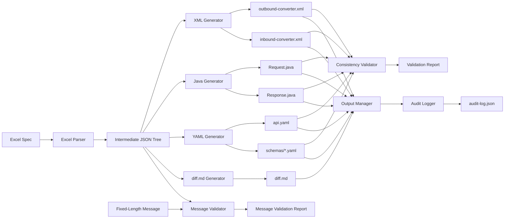

# MQ Message Spec Excel 自动化工具架构与技术设计文档

**文档版本**: v2.2
**创建日期**: 2026-01-04
**最后更新**: 2026-01-04
**文档状态**: 待评审
**基于需求文档**: 需求分析文档.md v1.2

---

## 目录

1. [概述](#1-概述)
2. [系统上下文与边界](#2-系统上下文与边界)
3. [高层架构](#3-高层架构)
4. [核心数据模型](#4-核心数据模型)
5. [Excel 解析设计](#5-excel-解析设计)
6. [生成器设计](#6-生成器设计)
7. [跨制品一致性验证器](#7-跨制品一致性验证器)
8. [规格与报文验证器](#8-规格与报文验证器)
9. [审计与可复现性](#9-审计与可复现性)
10. [输出管理与回滚](#10-输出管理与回滚)
11. [配置与命令行设计](#11-配置与命令行设计)
12. [错误处理与退出码](#12-错误处理与退出码)
13. [性能与扩展性考量](#13-性能与扩展性考量)
14. [安全性考量](#14-安全性考量)
15. [实施计划建议](#15-实施计划建议)
16. [待确认问题](#16-待确认问题)
17. [附录 A: 参考文件详细分析](#附录-a-参考文件详细分析)

---

## 1. 概述

### 1.1 问题概述

当前公司内部系统在 SAPI 与 APE 之间通过 IBM MQ 进行通信，使用固定长度报文格式。报文规范定义在 Excel 文件中（通常 400-500 行），开发人员需要手工创建：
- XML Bean 定义（用于报文序列化/反序列化）
- Java Bean 类（用于业务代码操作）
- OpenAPI YAML 文件（用于 API 定义和 Controller 生成）

这一流程错误率高、效率低、一致性难以保证，且问题往往在运行期或联调期才暴露。

### 1.2 系统目标

开发自动化工具，基于 Excel 规范文件：
1. **自动生成** XML Bean、Java Bean、OpenAPI YAML 制品
2. **确保一致性** 所有制品字段定义、顺序、类型完全一致
3. **支持审计** 完整溯源与复现能力
4. **支持验证** 规格与实际报文的一致性校验
5. **确定性输出** 相同输入 + 相同版本 = 相同输出

### 1.3 非目标 (Non-Goals)

明确**不在**本项目范围内：
- MQ 基础设施部署与配置
- 企业安全组件重新设计
- FlowService 组件修改
- Kotlin 业务逻辑代码生成（PostFlow、Mapper 等）
- Controller 代码生成（由 Maven OpenAPI 插件完成）
- Excel 规范文件格式重新设计
- 历史数据迁移
- 可视化 GUI 界面开发
- 多语言支持（仅支持 Java）
- 实时报文监控

### 1.4 关键架构驱动因素

1. **确定性 (Determinism)**: 相同输入 + 相同版本 → 相同输出（字节级别）
2. **顺序保留 (Order Preservation)**: Excel 中字段顺序在所有制品中严格保持
3. **可审计性 (Auditability)**: 输入、版本、环境、输出完整可追溯
4. **可扩展性 (Extensibility)**: 模板、规则、类型映射可配置和扩展

---

## 2. 系统上下文与边界

### 2.1 系统职责

**本系统做什么**:
- 解析 MQ Message Spec Excel 文件（.xlsx 格式）
- 生成中间 JSON 树（单一数据源）
- 基于 JSON 树生成 XML Bean、Java Bean、OpenAPI YAML
- 验证跨制品一致性
- 验证规格与实际报文的一致性
- 记录审计日志与字段映射表

**本系统不做什么**:
- 不修改输入 Excel 文件
- 不生成 Kotlin 代码或 Controller 代码
- 不部署或配置 MQ 基础设施
- 不提供实时监控或批量处理能力（本期）

### 2.2 外部依赖

| 依赖项 | 类型 | 用途 | 信任级别 |
|-------|------|------|---------|
| Excel 规范文件 | 输入 | Message Spec 定义 | 不可信（需验证） |
| Shared Header Excel | 输入 | 共享头部定义 | 不可信（需验证） |
| 公司内部 XML 加载组件 | 消费者 | 加载生成的 XML Bean | 可信 |
| Maven OpenAPI 插件 | 消费者 | 使用生成的 YAML 创建 Controller | 可信 |
| Apache POI | 库 | Excel 解析 | 可信 |
| JavaParser | 库 | Java 代码验证 | 可信 |
| SnakeYAML | 库 | YAML 生成 | 可信 |
| Swagger Parser | 库 | OpenAPI 验证 | 可信 |

### 2.3 信任边界

**输入信任边界**:
- Excel 文件被视为不可信输入
- 必须验证：文件存在性、格式正确性、必需列存在性、数据类型有效性
- 防止：公式注入、宏执行、路径遍历

**输出信任边界**:
- 所有生成的代码必须安全可编译
- 防止：代码注入、路径遍历、不安全的文件操作
- 敏感数据（报文内容）不得记录在日志或审计文件中

---

## 3. 高层架构

### 3.1 组件图

```
┌─────────────────────────────────────────────────────────────────┐
│                        CLI Entry Point                          │
│                (Command Line Interface & Config)                │
└──────────────────────────┬──────────────────────────────────────┘
                           │
                           ▼
┌─────────────────────────────────────────────────────────────────┐
│                     Orchestrator / Pipeline                     │
│              (Coordinates parsing, generation, validation)      │
└──┬────────┬────────┬──────────┬────────────┬───────────────────┘
   │        │        │          │            │
   ▼        ▼        ▼          ▼            ▼
┌──────┐ ┌──────┐ ┌──────┐ ┌──────────┐ ┌──────────────┐
│Excel │ │ JSON │ │ XML  │ │  Java    │ │   OpenAPI    │
│Parser│ │ Tree │ │ Gen  │ │   Gen    │ │   YAML Gen   │
└──┬───┘ └──┬───┘ └──┬───┘ └────┬─────┘ └──────┬───────┘
   │        │        │          │               │
   └────────┴────────┴──────────┴───────────────┘
                     │
                     ▼
        ┌────────────────────────────┐
        │  Cross-Artifact Validator  │
        │  (Consistency Checker)     │
        └────────────┬───────────────┘
                     │
                     ▼
        ┌────────────────────────────┐
        │ Spec-vs-Message Validator  │
        │  (Fixed-Length Parser)     │
        └────────────┬───────────────┘
                     │
                     ▼
        ┌────────────────────────────┐
        │   Output Manager           │
        │   (File Writer + Rollback) │
        └────────────┬───────────────┘
                     │
                     ▼
        ┌────────────────────────────┐
        │   Audit Logger             │
        │   (Provenance Recorder)    │
        └────────────────────────────┘
```

### 3.2 数据流概览



### 3.3 边界划分

| 组件 | 职责边界 |
|------|---------|
| Excel Parser | Excel → JSON Tree，仅负责解析和结构化，不生成代码 |
| Generators | JSON Tree → 制品，仅负责生成，不修改 JSON Tree |
| Validators | 读取制品 + JSON Tree，仅负责验证，不修改任何文件 |
| Output Manager | 管理文件写入和回滚，不涉及业务逻辑 |
| Audit Logger | 记录元数据，不修改业务数据 |

---

## 4. 核心数据模型

### 4.1 中间 JSON 树 (Intermediate JSON Tree)

#### 4.1.1 设计原则

1. **单一数据源**: 所有生成器仅从 JSON Tree 读取数据
2. **顺序保证**: 使用 `JSONArray` 或 `LinkedHashMap` 保证字段顺序
3. **元数据丰富**: 包含来源、原始名称、转换后名称、所有属性
4. **版本化**: 包含 schema 版本号，支持未来扩展

#### 4.1.2 JSON Schema 定义

参见需求文档 FR-001-04 中的 JSON Schema 定义。

关键字段说明：
- `metadata.sourceFile`: 原始 Excel 文件路径
- `metadata.sharedHeaderFile`: Shared Header 文件路径（如有）
- `metadata.parseTimestamp`: 解析时间戳（ISO 8601）
- `metadata.parserVersion`: 解析器语义化版本号
- `metadata.operationName`: 从 Excel 元数据行提取（Row 2, Column C）
- `metadata.operationId`: 从 Excel 元数据行提取（Row 3, Column C）
- `sharedHeader/request/response`: 包含字段组

#### 4.1.3 FieldNode 结构

```json
{
  "originalName": "domicleBranche",
  "camelCaseName": "domicleBranche",
  "className": null,
  "segLevel": 1,
  "length": 30,
  "dataType": "String",
  "optionality": "M",
  "defaultValue": null,
  "hardCodeValue": null,
  "groupId": null,
  "occurrenceCount": "1..1",
  "isArray": false,
  "isObject": false,
  "isTransitory": false,
  "children": [],
  "_source": {
    "sheetName": "Request",
    "rowIndex": 12
  }
}
```

**对象定义示例**:
```json
{
  "originalName": "CreateApp:CreateApplication",
  "camelCaseName": "createApp",
  "className": "CreateApplication",
  "segLevel": 1,
  "length": null,
  "dataType": null,
  "isObject": true,
  "isArray": false,
  "children": [
    {
      "originalName": "groupid",
      "camelCaseName": "groupid",
      "segLevel": 1,
      "length": 10,
      "dataType": "String",
      "defaultValue": "CREATEAPP",
      "groupId": "CREATEAPP",
      "isTransitory": true,
      "_source": {"sheetName": "Request", "rowIndex": 10}
    },
    {
      "originalName": "occurenceCount",
      "camelCaseName": "occurenceCount",
      "segLevel": 1,
      "length": 4,
      "dataType": "Unsigned Integer",
      "occurrenceCount": "1..1",
      "isTransitory": true,
      "_source": {"sheetName": "Request", "rowIndex": 11}
    },
    {
      "originalName": "domicleBranche",
      "camelCaseName": "domicleBranche",
      "segLevel": 1,
      "length": 30,
      "dataType": "String",
      "_source": {"sheetName": "Request", "rowIndex": 12}
    }
  ],
  "_source": {"sheetName": "Request", "rowIndex": 9}
}
```

**数组定义示例** (occurrenceCount = "0..9"):
```json
{
  "originalName": "CBACardArr:CBACardArray",
  "camelCaseName": "cbaCardArr",
  "className": "CBACardArray",
  "segLevel": 2,
  "isArray": true,
  "isObject": false,
  "occurrenceCount": "0..9",
  "children": [
    {
      "originalName": "groupid",
      "groupId": "CBADEL",
      "isTransitory": true,
      "_source": {"sheetName": "Request", "rowIndex": 19}
    },
    {
      "originalName": "occurenceCount",
      "occurrenceCount": "0..9",
      "isTransitory": true,
      "_source": {"sheetName": "Request", "rowIndex": 20}
    }
  ],
  "_source": {"sheetName": "Request", "rowIndex": 18}
}
```

#### 4.1.4 顺序保证机制

1. **解析时**: 按照 Excel 行顺序（从 Row 9 开始）顺序读取
2. **存储时**: 使用 `JSONArray` 存储 `fields` 列表，不使用 Map
3. **序列化时**: 使用 `Gson` 或 `Jackson` 的顺序保留配置
4. **生成时**: 遍历 `fields` 数组时严格按索引顺序

#### 4.1.5 元数据与溯源字段

| 字段 | 用途 | 生成时使用 | 审计使用 |
|------|------|-----------|---------|
| `originalName` | 原始字段名 | ✓ | ✓ |
| `camelCaseName` | 转换后名称 | ✓ | ✓ |
| `className` | 对象类名 | ✓ | ✓ |
| `_source.sheetName` | 来源 sheet | ✗ | ✓ |
| `_source.rowIndex` | 来源行号 | ✗ | ✓ |
| `groupId` | 分组标识值 | ✓ (仅 XML) | ✓ |
| `occurrenceCount` | 出现次数 | ✓ (仅 XML) | ✓ |
| `isTransitory` | 是否为辅助字段 | ✓ | ✓ |

### 4.2 内存领域对象

#### 4.2.1 核心类设计

```java
// 表示一个字段节点（可能是简单字段、对象或数组）
public class FieldNode {
    private String originalName;
    private String camelCaseName;
    private String className;  // 对象定义的类名
    private int segLevel;
    private Integer length;
    private String dataType;
    private String optionality;  // M/O
    private String defaultValue;
    private String hardCodeValue;
    private String groupId;
    private String occurrenceCount;
    private boolean isArray;
    private boolean isObject;
    private boolean isTransitory;
    private List<FieldNode> children;
    private SourceMetadata source;

    // Getters, Setters, Builder
}

public class SourceMetadata {
    private String sheetName;
    private int rowIndex;
    // Getters, Setters
}

public class MessageModel {
    private Metadata metadata;
    private FieldGroup sharedHeader;
    private FieldGroup request;
    private FieldGroup response;
    // Getters, Setters
}

public class FieldGroup {
    private List<FieldNode> fields;
    // Getters, Setters
}

public class Metadata {
    private String sourceFile;
    private String sharedHeaderFile;
    private String parseTimestamp;
    private String parserVersion;
    private String operationName;
    private String operationId;
    private String version;
    // Getters, Setters
}
```

---

## 5. Excel 解析设计

### 5.1 Excel 文件结构分析

#### 5.1.1 实际文件结构（基于 create_app.xlsx）

**Sheet 组成**:
- "Shared Header" sheet
- "Request" sheet
- "Response" sheet

**元数据行（前 7 行，Row 1-7）**:
```
Row 1: 标题 "Message Specification"
Row 2: "Operation Name" | <值: "Create application from SMP">
Row 3: "Operation ID" | <值: "CreateAppSMP"> | "Version" | <值: "01.00">
Row 4: "Service Category" | <值> | "Service Interface" | <值>
Row 5: "Service Component" | <值> | "Service ID" | <值>
Row 6: "Description" | <值>
Row 7: 空行
```

**Header 行（Row 8）**:
```
列 A: "Seg\nlvl"
列 B: "Field Name"
列 C: "Description "
列 D: "Length"
列 E: "Messaging\nDatatype"
列 F: "Opt(O/M)"
列 G: "Null\n(Y/N)"
列 H: "NLS\n(Y/N)"
列 I: "Sample Value(s)"
列 J: "Remarks"
列 K: "GMR Physical Name"
列 L: "Test Value"
```

**数据行（从 Row 9 开始）**:

示例 1 - 对象定义行:
```
Row 9:
  Seg lvl: "1"
  Field Name: "CreateApp:CreateApplication"
  Description: "This segment hold the new application information."
  Length: ""
  Messaging Datatype: ""
```

示例 2 - groupId 行:
```
Row 10:
  Seg lvl: "1"
  Field Name: "groupid"
  Description: "CREATEAPP"  ← groupId 值在 Description 列
  Length: "10"
  Messaging Datatype: "String"
```

示例 3 - occurrenceCount 行:
```
Row 11:
  Seg lvl: "1"
  Field Name: "occurenceCount"  ← 注意拼写错误
  Description: "1..1"  ← occurrenceCount 值在 Description 列
  Length: "4"
  Messaging Datatype: "Unsigned Integer"
```

示例 4 - 普通字段行:
```
Row 12:
  Seg lvl: "1"
  Field Name: "domicleBranche"
  Description: "1..1"
  Length: "30"
  Messaging Datatype: "String"
```

示例 5 - 数组对象定义:
```
Row 13:
  Field Name: "ProductDel:ProductDetails"
  Description: "This segment hold the product information"

Row 14:
  Field Name: "groupid"
  Description: "PRODDEL"

Row 15:
  Field Name: "occurenceCount"
  Description: "1..2"  ← 1..2 表示数组，最多 2 个元素
```

示例 6 - 嵌套对象（Seg lvl = 2）:
```
Row 18:
  Seg lvl: "2"
  Field Name: "CBACardArr:CBACardArray"
  Description: "This segment hold the CBA card array."

Row 19:
  Seg lvl: "2"
  Field Name: "groupid"
  Description: "CBADEL"

Row 20:
  Seg lvl: "2"
  Field Name: "occurenceCount"
  Description: "0..9"  ← 0..9 表示可选数组，最多 9 个元素
```

#### 5.1.2 列名规范化规则

Excel 列名可能包含换行符 `\n`，需要规范化：

| 原始列名 | 规范化后 | 匹配策略 |
|---------|---------|---------|
| "Seg\nlvl" | "Seg lvl" | 替换 `\n` 为空格并 trim |
| "Messaging\nDatatype" | "Messaging Datatype" | 同上 |
| "Null\n(Y/N)" | "Null (Y/N)" | 同上 |
| "NLS\n(Y/N)" | "NLS (Y/N)" | 同上 |

**实现策略**:
```java
public class ColumnNormalizer {
    public static String normalize(String columnName) {
        if (columnName == null) return null;
        return columnName.replace("\n", " ")
                         .replace("\r", " ")
                         .trim()
                         .replaceAll("\\s+", " ");
    }
}
```

#### 5.1.3 Shared Header 加载策略（解决 OQ-002）

**设计决策**: Shared Header 作为**独立内容**，不直接合并到 Request/Response 字段中。

**存储结构**:
```json
{
  "metadata": { ... },
  "sharedHeader": {
    "fields": [ /* Shared Header 字段列表 */ ]
  },
  "request": {
    "fields": [ /* Request 字段列表 */ ]
  },
  "response": {
    "fields": [ /* Response 字段列表 */ ]
  }
}
```

**加载逻辑**:
```java
public class SharedHeaderLoader {
    /**
     * 从独立文件或同一文件中加载 Shared Header
     * @param sharedHeaderFile 可选的独立 Shared Header 文件
     * @param mainSpecFile 主 Message Spec 文件
     */
    public FieldGroup loadSharedHeader(File sharedHeaderFile, File mainSpecFile) {
        Sheet headerSheet = null;

        if (sharedHeaderFile != null && sharedHeaderFile.exists()) {
            // 从独立文件加载
            Workbook wb = WorkbookFactory.create(sharedHeaderFile);
            headerSheet = wb.getSheet("Shared Header");
        } else {
            // 从主文件加载
            Workbook wb = WorkbookFactory.create(mainSpecFile);
            headerSheet = wb.getSheet("Shared Header");
        }

        if (headerSheet == null) {
            return new FieldGroup(); // 空 Header，非错误
        }

        return parseSheet(headerSheet);
    }
}
```

**使用场景**:
- XML 生成时：可根据需要选择是否包含 Shared Header 字段
- Java Bean 生成时：Shared Header 可生成独立的 `SharedHeader.java` 类
- OpenAPI 生成时：Shared Header 可生成为通用 Header 定义
- **灵活组装**：下游生成器可根据实际需要决定是否使用 Shared Header 内容

### 5.2 Sheet 发现与验证

#### 5.2.1 Sheet 发现算法

```java
public class SheetDiscovery {
    public SheetSet discoverSheets(Workbook workbook) {
        SheetSet sheets = new SheetSet();

        // 必需 sheets
        sheets.request = workbook.getSheet("Request");
        if (sheets.request == null) {
            throw new ParseException("Required sheet 'Request' not found");
        }

        sheets.response = workbook.getSheet("Response");
        if (sheets.response == null) {
            throw new ParseException("Required sheet 'Response' not found");
        }

        // 可选 sheet
        sheets.sharedHeader = workbook.getSheet("Shared Header");

        return sheets;
    }
}
```

#### 5.2.2 必需列验证

```java
public class ColumnValidator {
    private static final List<String> REQUIRED_COLUMNS = Arrays.asList(
        "Seg lvl",
        "Field Name",
        "Description",
        "Length",
        "Messaging Datatype"
    );

    public Map<String, Integer> validateAndMapColumns(Row headerRow) {
        Map<String, Integer> columnMap = new HashMap<>();

        for (Cell cell : headerRow) {
            String normalized = ColumnNormalizer.normalize(cell.getStringCellValue());
            columnMap.put(normalized, cell.getColumnIndex());
        }

        for (String required : REQUIRED_COLUMNS) {
            if (!columnMap.containsKey(required)) {
                throw new ParseException("Required column '" + required + "' not found in header row");
            }
        }

        return columnMap;
    }
}
```

### 5.3 元数据提取（前 7 行）

```java
public class MetadataExtractor {
    public Metadata extractMetadata(Sheet sheet) {
        Metadata meta = new Metadata();

        // Row 2, Column C (index 2): Operation Name
        Row row2 = sheet.getRow(1); // 0-indexed
        if (row2 != null) {
            Cell cell = row2.getCell(2);
            if (cell != null) {
                meta.setOperationName(cell.getStringCellValue());
            }
        }

        // Row 3, Column C (index 2): Operation ID
        // Row 3, Column E (index 4): Version
        Row row3 = sheet.getRow(2);
        if (row3 != null) {
            Cell cellC = row3.getCell(2);
            if (cellC != null) {
                meta.setOperationId(cellC.getStringCellValue());
            }

            Cell cellE = row3.getCell(4);
            if (cellE != null) {
                meta.setVersion(cellE.getStringCellValue());
            }
        }

        meta.setParseTimestamp(Instant.now().toString());
        meta.setParserVersion(VersionRegistry.getParserVersion());

        return meta;
    }
}
```

### 5.4 Seg lvl 嵌套算法

#### 5.4.1 算法描述

1. **维护栈结构**: 记录每个层级的当前父节点
2. **逐行处理**: 从 Row 9 开始顺序处理
3. **层级判断**:
   - 如果 `segLevel == 当前栈深度 + 1`: 添加到栈顶节点的 children
   - 如果 `segLevel <= 当前栈深度`: 弹出栈直到找到正确的父节点
4. **对象识别**: 如果是对象定义行，将该对象压入栈

#### 5.4.2 伪代码

```java
public class SegLevelParser {
    public List<FieldNode> parseFields(Sheet sheet, Map<String, Integer> columnMap) {
        List<FieldNode> rootFields = new ArrayList<>();
        Deque<FieldNode> stack = new ArrayDeque<>();

        int startRow = 8; // Row 9 (0-indexed = 8)

        for (int i = startRow; i <= sheet.getLastRowNum(); i++) {
            Row row = sheet.getRow(i);
            if (row == null) continue;

            FieldNode node = parseRow(row, columnMap, i + 1);
            if (node == null) continue;

            int segLevel = node.getSegLevel();

            // 调整栈深度到正确的父级
            while (!stack.isEmpty() && stack.peek().getSegLevel() >= segLevel) {
                stack.pop();
            }

            if (stack.isEmpty()) {
                // 顶层字段
                rootFields.add(node);
            } else {
                // 添加到父节点的 children
                stack.peek().getChildren().add(node);
            }

            // 如果是对象定义，压入栈
            if (node.isObject() || node.isArray()) {
                stack.push(node);
            }
        }

        return rootFields;
    }
}
```

#### 5.4.3 无效嵌套处理

**错误场景**:
- Seg lvl 跳跃（如 1 → 3，跳过 2）
- Seg lvl 为非正整数

**处理策略**:
```java
public void validateSegLevel(int segLevel, int previousLevel, int rowIndex) {
    if (segLevel <= 0) {
        throw new ParseException("Invalid Seg lvl " + segLevel + " at row " + rowIndex);
    }

    if (segLevel > previousLevel + 1) {
        throw new ParseException("Seg lvl jump from " + previousLevel + " to " + segLevel +
                                 " at row " + rowIndex + ". Missing intermediate level.");
    }
}
```

#### 5.4.4 嵌套深度限制（解决 OQ-005）

**设计决策**: 理论上支持无限层级嵌套，实际设置**默认最大深度为 50 层**。

**验证策略**:
```java
public class NestingDepthValidator {
    private static final int DEFAULT_MAX_DEPTH = 50;
    private int maxDepth;

    public NestingDepthValidator() {
        this(DEFAULT_MAX_DEPTH);
    }

    public NestingDepthValidator(int maxDepth) {
        this.maxDepth = maxDepth;
    }

    public void validateDepth(int currentDepth, int rowIndex, String fieldName) {
        if (currentDepth > maxDepth) {
            // 记录警告但不中断处理
            logger.warn("Nesting depth {} exceeds recommended maximum {} at row {} (field: {}). " +
                       "This may impact performance and readability.",
                       currentDepth, maxDepth, rowIndex, fieldName);
        }
    }
}
```

**配置参数**:
- CLI 参数: `--max-nesting-depth=N` （见 12.1 配置参数）
- 配置文件: `parser.maxNestingDepth: 50`

**行为说明**:
- 超过最大深度时：记录 **WARN** 级别日志，继续处理
- 不强制中断：允许处理深层嵌套的特殊场景
- 性能提示：建议最大深度不超过 10 层以保证可读性和性能

### 5.5 对象与数组检测

#### 5.5.1 对象定义识别

**规则**:
- Field Name 格式: `{fieldName}:{ClassName}`（包含冒号）
- Length 列为空
- Messaging Datatype 列为空

**实现**:
```java
public boolean isObjectDefinition(String fieldName, String length, String dataType) {
    return fieldName != null &&
           fieldName.contains(":") &&
           (length == null || length.trim().isEmpty()) &&
           (dataType == null || dataType.trim().isEmpty());
}

public ObjectDefinition parseObjectDefinition(String fieldName) {
    String[] parts = fieldName.split(":", 2);
    if (parts.length != 2) {
        throw new ParseException("Invalid object definition format: " + fieldName);
    }

    return new ObjectDefinition(
        parts[0].trim(),  // fieldName: "CreateApp"
        parts[1].trim()   // className: "CreateApplication"
    );
}
```

#### 5.5.2 数组 vs 对象判断

基于 **occurrenceCount** 值（从 Description 列提取）：

| occurrenceCount | 类型 | Java 类型 | XML 类型 | 说明 |
|-----------------|------|----------|---------|------|
| "1..1" | 对象 | NestedClass | CompositeField | 单一对象 |
| "0..1" | 对象 | NestedClass | CompositeField | 可选对象 |
| "1..N" (N > 1) | 数组 | List&lt;NestedClass&gt; | RepeatingField | 必需数组 |
| "0..N" (N > 1) | 数组 | List&lt;NestedClass&gt; | RepeatingField | 可选数组 |

**实现**:
```java
public class OccurrenceCountParser {
    private static final Pattern PATTERN = Pattern.compile("(\\d+)\\.\\.(\\d+)");

    public ArrayInfo parseOccurrenceCount(String occurrenceCount) {
        if (occurrenceCount == null || occurrenceCount.trim().isEmpty()) {
            return null;
        }

        Matcher matcher = PATTERN.matcher(occurrenceCount.trim());
        if (!matcher.matches()) {
            throw new ParseException("Invalid occurrenceCount format: " + occurrenceCount);
        }

        int min = Integer.parseInt(matcher.group(1));
        int max = Integer.parseInt(matcher.group(2));

        boolean isArray = (max > 1);
        boolean isOptional = (min == 0);

        return new ArrayInfo(min, max, isArray, isOptional);
    }
}
```

#### 5.5.3 groupId 和 occurrenceCount 的特殊处理

**识别规则**:
1. **groupId 行**:
   - Field Name = "groupid"（小写）
   - **Description 列包含 groupId 的值**（如 "CREATEAPP"）
   - Length = 10
   - Messaging Datatype = "String"

2. **occurrenceCount 行**:
   - Field Name = "occurenceCount"（注意拼写错误）
   - **Description 列包含 occurrenceCount 的值**（如 "1..1", "0..9"）
   - Length = 4
   - Messaging Datatype = "Unsigned Integer"

**实现**:
```java
public FieldNode parseRow(Row row, Map<String, Integer> columnMap, int rowIndex) {
    String fieldName = getCellValue(row, columnMap.get("Field Name"));
    String description = getCellValue(row, columnMap.get("Description"));
    String length = getCellValue(row, columnMap.get("Length"));
    String dataType = getCellValue(row, columnMap.get("Messaging Datatype"));

    FieldNode node = new FieldNode();
    node.setOriginalName(fieldName);
    node.getSource().setRowIndex(rowIndex);

    // 检测 groupId
    if ("groupid".equalsIgnoreCase(fieldName)) {
        node.setGroupId(description);  // ← groupId 值来自 Description 列
        node.setIsTransitory(true);
        node.setLength(parseLength(length));
        node.setDataType(dataType);
        return node;
    }

    // 检测 occurrenceCount
    if ("occurenceCount".equalsIgnoreCase(fieldName)) {
        node.setOccurrenceCount(description);  // ← occurrenceCount 值来自 Description 列
        node.setIsTransitory(true);
        node.setLength(parseLength(length));
        node.setDataType(dataType);
        return node;
    }

    // 检测对象定义
    if (isObjectDefinition(fieldName, length, dataType)) {
        ObjectDefinition objDef = parseObjectDefinition(fieldName);
        node.setCamelCaseName(toCamelCase(objDef.fieldName));
        node.setClassName(objDef.className);
        node.setIsObject(true);
        return node;
    }

    // 普通字段
    node.setCamelCaseName(toCamelCase(fieldName));
    node.setLength(parseLength(length));
    node.setDataType(dataType);

    return node;
}
```

#### 5.5.4 fixedCount 计算规则

从 `occurrenceCount` 中提取 `fixedCount` 用于 XML `RepeatingField`：

| occurrenceCount | fixedCount（XML） | 说明 |
|-----------------|------------------|------|
| "0..9" | 9 | 取最大值 |
| "1..2" | 2 | 取最大值 |
| "0..5" | 5 | 取最大值 |

```java
public int calculateFixedCount(String occurrenceCount) {
    ArrayInfo info = parseOccurrenceCount(occurrenceCount);
    return info.getMax();
}
```

### 5.6 命名规范化

#### 5.6.1 camelCase 转换规则（含 CJK 处理，解决 OQ-004）

| 原始名称 | 转换后 | 规则 |
|---------|--------|------|
| DOMICILE_BRANCH | domicileBranch | 下划线分隔 → 驼峰 |
| response-code | responseCode | 连字符分隔 → 驼峰 |
| ResponseCode | responseCode | 首字母小写 |
| domicleBranche | domicleBranche | 保持原样（已是驼峰） |
| 123StartWithNumber | field123StartWithNumber | 数字开头添加 "field" 前缀 |
| special!@#chars | specialChars | 移除非字母数字字符 |
| 客户姓名 | keHuXingM8a3f | **CJK → 拼音驼峰，限制 10 字符+哈希后缀** |
| 账户余额_CNY | zhangHuYuE | CJK + 下划线混合处理 |

**实现**（含 CJK 处理）:
```java
import net.sourceforge.pinyin4j.PinyinHelper;
import java.security.MessageDigest;

public class CamelCaseConverter {
    private static final int MAX_LENGTH = 10; // OQ-004: 长度限制

    public String toCamelCase(String input) {
        if (input == null || input.isEmpty()) {
            return input;
        }

        // Step 1: 处理 CJK 字符转拼音
        String processed = convertCJKToPinyin(input);

        // Step 2: 移除特殊字符，仅保留字母、数字、下划线、连字符
        String cleaned = processed.replaceAll("[^a-zA-Z0-9_-]", "");

        // Step 3: 按下划线或连字符分隔
        String[] parts = cleaned.split("[_-]");

        StringBuilder result = new StringBuilder();
        for (int i = 0; i < parts.length; i++) {
            String part = parts[i];
            if (part.isEmpty()) continue;

            if (i == 0) {
                // 首部分首字母小写
                result.append(part.substring(0, 1).toLowerCase());
                if (part.length() > 1) {
                    result.append(part.substring(1).toLowerCase());
                }
            } else {
                // 后续部分首字母大写
                result.append(part.substring(0, 1).toUpperCase());
                if (part.length() > 1) {
                    result.append(part.substring(1).toLowerCase());
                }
            }
        }

        String camelCase = result.toString();

        // Step 4: 处理数字开头
        if (!camelCase.isEmpty() && Character.isDigit(camelCase.charAt(0))) {
            camelCase = "field" + camelCase;
        }

        // Step 5: 长度限制处理（OQ-004）
        if (camelCase.length() > MAX_LENGTH) {
            String hash = generateHash(camelCase);
            camelCase = camelCase.substring(0, MAX_LENGTH - 4) + hash;
        }

        return camelCase;
    }

    /**
     * 将 CJK 字符转换为拼音
     */
    private String convertCJKToPinyin(String input) {
        StringBuilder pinyin = new StringBuilder();
        for (char ch : input.toCharArray()) {
            if (Character.UnicodeBlock.of(ch) == Character.UnicodeBlock.CJK_UNIFIED_IDEOGRAPHS) {
                // 中文字符转拼音
                String[] pinyinArray = PinyinHelper.toHanyuPinyinStringArray(ch);
                if (pinyinArray != null && pinyinArray.length > 0) {
                    // 取无声调拼音，首字母大写用于驼峰
                    String py = pinyinArray[0].replaceAll("[0-9]", "");
                    pinyin.append(py);
                } else {
                    pinyin.append(ch); // 无法转换则保留
                }
            } else {
                pinyin.append(ch);
            }
        }
        return pinyin.toString();
    }

    /**
     * 生成 4 位哈希后缀确保唯一性
     */
    private String generateHash(String input) {
        try {
            MessageDigest md = MessageDigest.getInstance("MD5");
            byte[] hash = md.digest(input.getBytes());
            return String.format("%02x%02x", hash[0], hash[1]); // 取前 4 位十六进制
        } catch (Exception e) {
            return "0000";
        }
    }
}
```

**依赖库**:
- `pinyin4j`: 用于中文转拼音（需在 `pom.xml` 中添加依赖）

**示例转换**:
```java
converter.toCamelCase("客户姓名");           // → "keHuXingMing" (< 10 字符，无需哈希)
converter.toCamelCase("客户详细信息记录表");  // → "keHuXiangXi5a3f" (超过 10 字符，截断+哈希)
converter.toCamelCase("账户_余额_CNY");      // → "zhangHuYuECny"
```

#### 5.6.2 重复检测与处理

**策略**: 同一层级内字段名不得重复

```java
public class DuplicateDetector {
    public void detectDuplicates(List<FieldNode> fields) {
        Set<String> names = new HashSet<>();

        for (FieldNode field : fields) {
            String name = field.getCamelCaseName();
            if (names.contains(name)) {
                throw new ParseException("Duplicate field name '" + name +
                    "' at row " + field.getSource().getRowIndex() +
                    ". Original name: '" + field.getOriginalName() + "'");
            }
            names.add(name);

            // 递归检查子节点
            if (!field.getChildren().isEmpty()) {
                detectDuplicates(field.getChildren());
            }
        }
    }
}
```

**待确认项 TBC-003**: 是否允许自动重命名（如添加数字后缀）？当前设计为报错并停止。

#### 5.6.3 重命名记录

所有字段名转换均记录到 `diff.md` 文件：
- 原始名称: `originalName`
- 转换后名称: `camelCaseName`
- 来源信息: `_source.sheetName`, `_source.rowIndex`

### 5.7 确定性保证

#### 5.7.1 稳定排序规则

1. **字段顺序**: 严格按照 Excel 行顺序（Row 9, 10, 11, ...）
2. **不使用 HashMap**: 使用 `LinkedHashMap` 或 `List` 保证插入顺序
3. **不使用 HashSet**: 使用 `LinkedHashSet` 保证迭代顺序

#### 5.7.2 JSON 序列化确定性

```java
public class DeterministicJsonWriter {
    private Gson gson;

    public DeterministicJsonWriter() {
        this.gson = new GsonBuilder()
            .setPrettyPrinting()
            .disableHtmlEscaping()
            .serializeNulls()  // 可选：包含 null 值
            .create();
    }

    public void writeJsonTree(MessageModel model, Path outputPath) {
        String json = gson.toJson(model);

        // 使用 UTF-8 编码，确保跨平台一致性
        Files.writeString(outputPath, json, StandardCharsets.UTF_8);
    }
}
```

---

## 6. 生成器设计

### 6.1 XML Bean 生成器

#### 6.1.1 设计目标

基于中间 JSON Tree 生成：
- `outbound-converter.xml`（请求）
- `inbound-converter.xml`（响应）

**关键要求**:
1. 字段顺序与 Excel 完全一致
2. `groupId` 和 `occurrenceCount` 作为 transitory field 包含
3. 正确设置 `type`、`length`、`converter` 等属性
4. `forType` 遵循命名约定: `com.rtm.{project}.{ClassName}`

#### 6.1.2 模板策略

使用外部 XML 模板文件（可替换）：
- `templates/outbound-converter-template.xml`
- `templates/inbound-converter-template.xml`

**模板引擎选择**:
- **方案 1**: 使用 Velocity 或 FreeMarker（推荐）
- **方案 2**: 使用字符串拼接（简单场景）

#### 6.1.3 命名空间配置（解决 OQ-001）

**问题**: outbound-converter.xml 使用占位符命名空间 `xmlns="xxx"`，实际应使用真实命名空间。

**解决方案**: 使用配置文件指定命名空间

```yaml
# config.yaml
xml:
  namespace:
    inbound: "http://www.hsbc.com/schema/esf-hosadapter2/fixlength-2.0.0"
    outbound: "http://www.hsbc.com/schema/esf-hosadapter2/fixlength-2.0.0"
  project:
    groupId: "com.rtm"
    artifactId: "test"  # 用于 forType: com.rtm.{artifactId}.ClassName
```

**XML 模板示例**:
```xml
<?xml version="1.0" encoding="UTF-8"?>
<beans:beans xmlns:xsi="http://www.w3.org/2001/XMLSchema-instance"
             xmlns="${xml.namespace.outbound}">
  <fix-length-outbound-converter id="req_converter" codeGen="true">
    <message forType="${xml.project.groupId}.${xml.project.artifactId}.${operationId}Request">
      <!-- 字段列表由模板引擎填充 -->
      #foreach($field in $fields)
        ${field.toXml()}
      #end
    </message>
  </fix-length-outbound-converter>
</beans:beans>
```

#### 6.1.4 字段类型映射规则

**基于参考文件分析**:

| 条件 | XML type | 属性 | 说明 |
|------|---------|------|------|
| `isTransitory == true && groupId != null` | DataField | `transitory="true"`, `defaultValue="{groupId}"`, `length="10"`, `fixedLength="true"`, `converter="stringFieldConverter"` | groupId 辅助字段 |
| `isTransitory == true && occurrenceCount != null` | DataField | `transitory="true"`, `defaultValue="{count}"`, `length="4"`, `fixedLength="true"`, `pad="0"`, `alignRight="true"`, `converter="counterFieldConverter"` | occurrenceCount 辅助字段 |
| `isObject == true && isArray == false` | CompositeField | `name="{camelCaseName}"`, `forType="{forType}"` | 单一对象 |
| `isArray == true` | RepeatingField | `name="{camelCaseName}"`, `fixedCount="{count}"`, `forType="{forType}"` | 数组 |
| `dataType == "String"` | DataField | `name="{camelCaseName}"`, `length="{length}"`, `nullPad=" "`, `converter="stringFieldConverter"` | 字符串字段 |
| `dataType == "Unsigned Integer"` | DataField | `name="{camelCaseName}"`, `length="{length}"`, `pad="0"`, `alignRight="true"`, `converter="stringFieldConverter"` | 数字字段 |
| `dataType == "Amount"` 或 `"Currency"` | DataField | `name="{camelCaseName}"`, `length="{length}"`, `floatingNumberLength="{precision}"`, `nullPad=" "`, `converter="OHcurrencyamountFieldConverter"`, `forType="java.math.BigDecimal"` | 金额字段 |

**converter 映射表**:

| Excel dataType | converter | forType |
|---------------|-----------|---------|
| String, AN | stringFieldConverter | (无) |
| Number, N, Unsigned Integer | stringFieldConverter | (无) |
| Amount, Currency | OHcurrencyamountFieldConverter | java.math.BigDecimal |
| Date | (待确认) | (待确认) |

**待确认项 TBC-009**: 完整的 converter 类型列表需与公司内部组件文档对齐。

#### 6.1.5 forType 命名约定

**规则**: `com.rtm.{project}.{ClassName}`

**实现**:
```java
public String buildForType(String className) {
    String groupId = config.getXml().getProject().getGroupId();  // "com.rtm"
    String artifactId = config.getXml().getProject().getArtifactId();  // "test"
    return groupId + "." + artifactId + "." + className;
}

// 示例：
// buildForType("CreateApplicationRequest") → "com.rtm.test.CreateApplicationRequest"
// buildForType("ResponseCode") → "com.rtm.test.ResponseCode"
```

**待确认项 TBC-002**: `{project}` 部分的具体命名规范（是否使用 artifactId、是否可配置）。

#### 6.1.6 transitory 字段生成

**groupId 字段示例**:
```xml
<field type="DataField"
       length="10"
       fixedLength="true"
       transitory="true"
       defaultValue="CREATEAPP"
       converter="stringFieldConverter" />
```

**occurrenceCount 字段示例**:
```xml
<field type="DataField"
       length="4"
       fixedLength="true"
       transitory="true"
       defaultValue="1"
       pad="0"
       alignRight="true"
       converter="counterFieldConverter" />
```

**生成逻辑**:
```java
public String generateTransitoryField(FieldNode node) {
    if (node.getGroupId() != null) {
        return String.format(
            "<field type=\"DataField\" length=\"10\" fixedLength=\"true\" " +
            "transitory=\"true\" defaultValue=\"%s\" " +
            "converter=\"stringFieldConverter\" />",
            node.getGroupId()
        );
    }

    if (node.getOccurrenceCount() != null) {
        int count = calculateFixedCount(node.getOccurrenceCount());
        return String.format(
            "<field type=\"DataField\" length=\"4\" fixedLength=\"true\" " +
            "transitory=\"true\" defaultValue=\"%d\" pad=\"0\" " +
            "alignRight=\"true\" converter=\"counterFieldConverter\" />",
            count
        );
    }

    return "";
}
```

#### 6.1.7 输出文件位置

```
{output-root}/
├── xml/
│   ├── outbound-converter.xml  # 请求
│   └── inbound-converter.xml   # 响应
```

**待确认项 TBC-005**: 输出目录结构是否可配置。

#### 6.1.8 示例代码片段

**CompositeField 示例**:
```xml
<field name="responseCode" type="CompositeField" forType="com.rtm.test.ResponseCode">
  <field name="responseCode" type="DataField" length="3" defaultValue="00"
         nullPad=" " converter="stringFieldConverter" />
</field>
```

**RepeatingField 示例**:
```xml
<field name="reasonCde" type="RepeatingField" fixedCount="1" forType="com.rtm.test.ReasonCode">
  <field name="reasonCode" type="DataField" length="7" defaultValue="00"
         nullPad=" " converter="stringFieldConverter" />
  <field name="amount" type="DataField" length="23" floatingNumberLength="18"
         nullPad=" " converter="OHcurrencyamountFieldConverter" forType="java.math.BigDecimal" />
</field>
```

### 6.2 Java Bean 生成器

#### 6.2.1 设计目标

基于中间 JSON Tree 生成 Java POJO 类：
- `{OperationId}Request.java`
- `{OperationId}Response.java`
- 所有嵌套类（独立文件）

**关键要求**:
1. **不得包含 groupId 和 occurrenceCount 字段**
2. 字段名使用 `camelCaseName`
3. 类名使用 Request/Response 后缀
4. 数据类型与 XML Bean 一致
5. 代码可编译通过

#### 6.2.2 包与类命名规则

**包名**: `{groupId}.{artifactId}.model`

示例: `com.rtm.test.model`

**类名规则**:
- 请求类: `{OperationId}Request`
- 响应类: `{OperationId}Response`
- 嵌套类: `{ClassName}`（从 Excel 对象定义中提取）

示例:
```
CreateAppSMPRequest.java
CreateAppSMPResponse.java
CreateApplication.java
ProductDetails.java
CBACardArray.java
ResponseCode.java
ReasonCode.java
```

#### 6.2.3 嵌套类策略

**方案选择**: 每个类独立文件（推荐）

**理由**:
- Maven OpenAPI 生成的类也是独立文件
- 便于字段名一致性验证
- 符合 Java 编码规范

**备选方案**: 内部类（不推荐）

#### 6.2.4 数据类型映射规则

| Excel dataType | Java Type | 备注 |
|---------------|----------|------|
| String, AN | String | 字符串 |
| Number, N, Unsigned Integer | String | 保持字符串（定长报文特性） |
| Amount, Currency | java.math.BigDecimal | 金额 |
| Date | String | 格式化日期字符串（待确认） |
| Object (1..1 或 0..1) | {ClassName} | 嵌套对象 |
| Array (0..N 或 1..N) | java.util.List&lt;{ClassName}&gt; | 数组 |

#### 6.2.5 字段排除规则

**排除以下字段**:
- `isTransitory == true`（包括 groupId 和 occurrenceCount）

**实现**:
```java
public List<FieldNode> filterTransitoryFields(List<FieldNode> fields) {
    return fields.stream()
        .filter(field -> !field.isTransitory())
        .collect(Collectors.toList());
}
```

#### 6.2.6 代码生成模板

**使用 JavaPoet（推荐）或字符串拼接**

示例（不使用 Lombok）:
```java
public class CreateApplicationRequest {
    private CreateApplication createApp;
    private ProductDetails productDel;

    public CreateApplication getCreateApp() {
        return createApp;
    }

    public void setCreateApp(CreateApplication createApp) {
        this.createApp = createApp;
    }

    public ProductDetails getProductDel() {
        return productDel;
    }

    public void setProductDel(ProductDetails productDel) {
        this.productDel = productDel;
    }
}
```

示例（使用 Lombok）:
```java
import lombok.Data;

@Data
public class CreateApplicationRequest {
    private CreateApplication createApp;
    private ProductDetails productDel;
}
```

**待确认项 TBC-001**: 是否使用 Lombok 注解。

#### 6.2.7 可编译性要求

**验证策略**: 使用 JavaParser 进行编译检查（不使用正则）

```java
public class JavaCompilabilityValidator {
    public void validate(Path javaFile) throws ParseException {
        try {
            // 使用 JavaParser 解析
            CompilationUnit cu = StaticJavaParser.parse(javaFile);

            // 检查语法错误
            if (cu.getProblems().size() > 0) {
                throw new ValidationException("Java file has syntax errors: " +
                    cu.getProblems());
            }

        } catch (Exception e) {
            throw new ValidationException("Failed to parse Java file: " + javaFile, e);
        }
    }
}
```

#### 6.2.8 输出结构

```
{output-root}/
├── java/
│   ├── com/
│   │   └── rtm/
│   │       └── test/
│   │           └── model/
│   │               ├── CreateAppSMPRequest.java
│   │               ├── CreateAppSMPResponse.java
│   │               ├── CreateApplication.java
│   │               ├── ProductDetails.java
│   │               ├── CBACardArray.java
│   │               ├── ResponseCode.java
│   │               └── ReasonCode.java
```

#### 6.2.9 枚举辅助方法生成（解决 OQ-003）

**设计决策**: 对于枚举值类型字段（如 Hard code Value 列包含 "a=1,b=2" 格式），不在默认值中体现，而是生成辅助方法便于运行时映射。

**识别规则**:
- Hard code Value / Description 列包含枚举格式: `value1=code1,value2=code2`
- 例如: `"Y=1,N=0"`, `"ACTIVE=A,INACTIVE=I"`

**生成策略**:
```java
@Data
public class ExampleRequest {
    private String statusFlag; // 原始字段，存储报文值 "1" 或 "0"

    /**
     * 辅助方法：将报文值转换为枚举
     * 枚举定义: Y=1, N=0
     */
    public StatusFlagEnum getStatusFlagEnum() {
        return StatusFlagEnum.fromCode(this.statusFlag);
    }

    public void setStatusFlagEnum(StatusFlagEnum enumValue) {
        this.statusFlag = enumValue != null ? enumValue.getCode() : null;
    }

    // 嵌套枚举定义
    public enum StatusFlagEnum {
        YES("1", "Y"),
        NO("0", "N");

        private final String code;    // 报文值
        private final String label;   // 语义标签

        StatusFlagEnum(String code, String label) {
            this.code = code;
            this.label = label;
        }

        public String getCode() { return code; }
        public String getLabel() { return label; }

        public static StatusFlagEnum fromCode(String code) {
            for (StatusFlagEnum e : values()) {
                if (e.code.equals(code)) return e;
            }
            return null;
        }
    }
}
```

**生成规则**:
1. 原始字段类型保持为 `String`（存储报文值）
2. 为每个枚举字段生成配对的 `getXxxEnum()` 和 `setXxxEnum()` 方法
3. 在同一类中生成嵌套 `enum XxxEnum`
4. 枚举包含 `fromCode()` 静态方法用于反向查找

**优势**:
- 保持 XML Bean 与 Java Bean 的字段一致性（都是 String）
- 便于 Mapper 代码进行枚举映射
- 提供类型安全的枚举访问
- 不影响原始报文值的读写

**可选性**: 此功能可通过配置开启/关闭
```yaml
# config.yml
generation:
  generateEnumHelpers: true  # 默认 true
```

### 6.3 OpenAPI YAML 生成器

#### 6.3.1 设计目标

基于中间 JSON Tree 生成符合 OpenAPI 3.x 的 YAML 文件：
- 主入口文件 `api.yaml`
- 按目录拆分 schemas（request/response/common）
- 使用 `$ref` 引用

**关键要求**:
1. **不得包含 groupId 和 occurrenceCount 字段**
2. 字段名与 Java Bean 完全一致
3. 通过 OAS 3.x 验证器验证
4. Maven OpenAPI 插件可正确生成代码

#### 6.3.2 OAS 版本与验证器策略

**目标版本**: OpenAPI 3.0.3

**验证器**: Swagger Parser

```java
public class OpenApiValidator {
    public void validate(Path apiYamlFile) {
        OpenAPIV3Parser parser = new OpenAPIV3Parser();
        SwaggerParseResult result = parser.readLocation(apiYamlFile.toString(), null, null);

        if (!result.getMessages().isEmpty()) {
            throw new ValidationException("OpenAPI validation failed: " + result.getMessages());
        }
    }
}
```

#### 6.3.3 拆分目录布局与 $ref 策略

**目录结构**:
```
{output-root}/
├── openapi/
│   ├── api.yaml                          # 主入口
│   ├── headers/
│   │   ├── request-headers.yaml
│   │   └── response-headers.yaml
│   ├── schemas/
│   │   ├── request/
│   │   │   ├── CreateAppSMPRequestSchema.yaml
│   │   │   ├── CreateApplication.yaml
│   │   │   └── ProductDetails.yaml
│   │   ├── response/
│   │   │   ├── CreateAppSMPResponseSchema.yaml
│   │   │   └── ResponseCode.yaml
│   │   └── common/
│   │       └── CommonTypes.yaml
│   └── errors/
│       └── ErrorResponse.yaml
```

**$ref 引用示例**:
```yaml
# api.yaml
openapi: 3.0.3
info:
  title: Create Application API
  version: 1.0.0
paths:
  /api/v1/create-app-smp:
    post:
      operationId: createCreditCardAccountApplication
      requestBody:
        content:
          application/json:
            schema:
              $ref: './schemas/request/CreateAppSMPRequestSchema.yaml'
      responses:
        '201':
          description: Created
          content:
            application/json:
              schema:
                $ref: './schemas/response/CreateAppSMPResponseSchema.yaml'
```

```yaml
# schemas/request/CreateAppSMPRequestSchema.yaml
type: object
properties:
  createApp:
    $ref: './CreateApplication.yaml'
  productDel:
    $ref: './ProductDetails.yaml'
```

#### 6.3.4 Endpoint 推导规则

**基于 Operation Name** (从 Excel 元数据 Row 2, Column C 提取):

| Operation Name | Endpoint Path | HTTP Method |
|----------------|---------------|-------------|
| "Create application from SMP" | /api/v1/create-application-from-smp | POST |

**推导算法**:
1. 转换为小写
2. 替换空格为连字符 `-`
3. 添加前缀 `/api/v1/`

```java
public String deriveEndpoint(String operationName) {
    return "/api/v1/" + operationName.toLowerCase()
                                     .trim()
                                     .replaceAll("\\s+", "-");
}
```

**待确认项 TBC-004**: 是否允许用户显式提供 Endpoint 路径。

#### 6.3.5 Schema 生成映射规则

| FieldNode 属性 | OpenAPI Schema | 说明 |
|---------------|----------------|------|
| `dataType == "String"` | `type: string` | 字符串 |
| `dataType == "Unsigned Integer"` | `type: string` | 保持字符串 |
| `dataType == "Amount"` | `type: string`, `format: decimal` | 金额 |
| `isArray == true` | `type: array`, `items: {$ref}` | 数组 |
| `isObject == true` | `$ref: './ClassName.yaml'` | 对象引用 |
| `optionality == "M"` | 添加到 `required` 列表 | 必填字段 |
| `defaultValue != null` | `default: "{value}"` | 默认值 |

**字段排除规则**:
```java
public List<FieldNode> filterForOpenApi(List<FieldNode> fields) {
    return fields.stream()
        .filter(field -> !field.isTransitory())  // 排除 transitory 字段
        .collect(Collectors.toList());
}
```

#### 6.3.6 示例 YAML 片段

**Request Schema**:
```yaml
# CreateAppSMPRequestSchema.yaml
type: object
required:
  - createApp
properties:
  createApp:
    $ref: './CreateApplication.yaml'
  productDel:
    $ref: './ProductDetails.yaml'
```

**Nested Object Schema**:
```yaml
# CreateApplication.yaml
type: object
required:
  - domicleBranche
properties:
  domicleBranche:
    type: string
    maxLength: 30
```

**Array Schema**:
```yaml
# ProductDetails.yaml
type: object
properties:
  cbaCardArr:
    type: array
    items:
      $ref: './CBACardArray.yaml'
    maxItems: 9
```

### 6.4 diff.md 生成器（FR-005）

#### 6.4.1 设计目标

生成字段名称映射表，记录：
- 原始字段名（Excel 中的名称）
- 转换后字段名（camelCase）
- 数据类型
- 来源信息（sheet 名、行号）

#### 6.4.2 生成算法

```java
public class DiffMdGenerator {
    public void generate(MessageModel model, Path outputPath) {
        StringBuilder md = new StringBuilder();

        md.append("# 字段名称映射表\n\n");
        md.append("生成时间: ").append(model.getMetadata().getParseTimestamp()).append("\n");
        md.append("源文件: ").append(model.getMetadata().getSourceFile()).append("\n\n");

        // Request 字段
        md.append("## Request 字段\n\n");
        md.append("| 原始名称 | 生成名称 | 数据类型 | 来源 Sheet | 行号 |\n");
        md.append("|---------|---------|---------|-----------|------|\n");
        appendFields(md, model.getRequest().getFields());

        // Response 字段
        md.append("\n## Response 字段\n\n");
        md.append("| 原始名称 | 生成名称 | 数据类型 | 来源 Sheet | 行号 |\n");
        md.append("|---------|---------|---------|-----------|------|\n");
        appendFields(md, model.getResponse().getFields());

        // Shared Header 字段
        if (model.getSharedHeader() != null) {
            md.append("\n## Shared Header 字段\n\n");
            md.append("| 原始名称 | 生成名称 | 数据类型 | 来源 Sheet | 行号 |\n");
            md.append("|---------|---------|---------|-----------|------|\n");
            appendFields(md, model.getSharedHeader().getFields());
        }

        Files.writeString(outputPath, md.toString(), StandardCharsets.UTF_8);
    }

    private void appendFields(StringBuilder md, List<FieldNode> fields) {
        for (FieldNode field : fields) {
            // 跳过 transitory 字段
            if (field.isTransitory()) {
                continue;
            }

            md.append("| ")
              .append(field.getOriginalName()).append(" | ")
              .append(field.getCamelCaseName()).append(" | ")
              .append(field.getDataType() != null ? field.getDataType() : "Object").append(" | ")
              .append(field.getSource().getSheetName()).append(" | ")
              .append(field.getSource().getRowIndex()).append(" |\n");

            // 递归处理子字段
            if (!field.getChildren().isEmpty()) {
                appendFields(md, field.getChildren());
            }
        }
    }
}
```

#### 6.4.3 输出位置

```
{output-root}/
├── diff.md
```

#### 6.4.4 示例输出

```markdown
# 字段名称映射表

生成时间: 2026-01-04T10:00:00Z
源文件: G:\markdown\task\ai-mq\.claude\commands\reference\create_app.xlsx

## Request 字段

| 原始名称 | 生成名称 | 数据类型 | 来源 Sheet | 行号 |
|---------|---------|---------|-----------|------|
| CreateApp:CreateApplication | createApp | Object | Request | 9 |
| domicleBranche | domicleBranche | String | Request | 12 |
| ProductDel:ProductDetails | productDel | Object | Request | 13 |
| produtID | produtID | String | Request | 16 |
| cBAIndicator | cbaIndicator | String | Request | 17 |
| CBACardArr:CBACardArray | cbaCardArr | Object | Request | 18 |

## Response 字段

| 原始名称 | 生成名称 | 数据类型 | 来源 Sheet | 行号 |
|---------|---------|---------|-----------|------|
| responseCode | responseCode | String | Response | 10 |
```

---

## 7. 跨制品一致性验证器

### 7.1 设计目标

验证生成的 XML Bean、Java Bean、OpenAPI YAML 之间的一致性：
- 字段名称一致
- 数据类型兼容
- 必填字段一致
- 默认值一致
- 顺序一致（对 XML）

### 7.2 比较源

1. **中间 JSON Tree** (单一真实源)
2. **生成的 XML Bean 文件**
3. **生成的 Java Bean 文件**
4. **生成的 OpenAPI YAML 文件**

### 7.3 验证规则（VR-101..VR-109）

| 验证规则编号 | 验证内容 | 错误级别 | 实现方法 |
|------------|---------|---------|---------|
| VR-101 | XML Bean 字段顺序与 JSON Tree 一致 | ERROR | 顺序比对 |
| VR-102 | Java Bean 字段名与 XML Bean name 属性一致 | ERROR | 字段名比对 |
| VR-103 | Java Bean 字段类型与 XML Bean converter 匹配 | ERROR | 类型映射验证 |
| VR-104 | YAML schema 属性名与 Java Bean 字段名一致 | ERROR | 字段名比对 |
| VR-105 | YAML schema 类型与 Java Bean 类型兼容 | ERROR | 类型映射验证 |
| VR-106 | groupId 未出现在 Java Bean 中 | ERROR | 字段扫描 |
| VR-107 | groupId 未出现在 YAML 中 | ERROR | YAML 扫描 |
| VR-108 | occurrenceCount 未出现在 Java Bean 中 | ERROR | 字段扫描 |
| VR-109 | occurrenceCount 未出现在 YAML 中 | ERROR | YAML 扫描 |

### 7.4 XML Bean 验证

**使用 DOM Parser 解析 XML**（不使用正则）:

```java
public class XmlBeanValidator {
    public ValidationResult validate(Path xmlFile, MessageModel jsonTree) {
        Document doc = parseXml(xmlFile);
        NodeList fieldNodes = doc.getElementsByTagName("field");

        List<ValidationError> errors = new ArrayList<>();

        // VR-101: 顺序验证
        List<String> xmlFieldNames = extractFieldNames(fieldNodes);
        List<String> jsonFieldNames = extractFieldNames(jsonTree.getRequest().getFields());

        if (!xmlFieldNames.equals(jsonFieldNames)) {
            errors.add(new ValidationError("VR-101", "Field order mismatch",
                "Expected: " + jsonFieldNames + ", Actual: " + xmlFieldNames));
        }

        // VR-102: 字段名验证
        // ...

        return new ValidationResult(errors);
    }
}
```

### 7.5 Java Bean 验证

**使用 JavaParser 解析 Java 代码**:

```java
public class JavaBeanValidator {
    public ValidationResult validate(Path javaFile, FieldGroup jsonFields) {
        CompilationUnit cu = StaticJavaParser.parse(javaFile);

        List<ValidationError> errors = new ArrayList<>();

        // 提取类中的所有字段
        List<FieldDeclaration> fields = cu.findAll(FieldDeclaration.class);

        // VR-106, VR-108: 检查 groupId 和 occurrenceCount 不存在
        for (FieldDeclaration field : fields) {
            String fieldName = field.getVariable(0).getNameAsString();
            if ("groupId".equals(fieldName) || "groupid".equalsIgnoreCase(fieldName)) {
                errors.add(new ValidationError("VR-106",
                    "groupId found in Java Bean",
                    "Field 'groupId' should not exist in Java Bean"));
            }
            if ("occurrenceCount".equalsIgnoreCase(fieldName)) {
                errors.add(new ValidationError("VR-108",
                    "occurrenceCount found in Java Bean",
                    "Field 'occurrenceCount' should not exist in Java Bean"));
            }
        }

        // VR-102, VR-103: 字段名和类型验证
        // ...

        return new ValidationResult(errors);
    }
}
```

### 7.6 OpenAPI YAML 验证

**使用 SnakeYAML 解析**:

```java
public class OpenApiValidator {
    public ValidationResult validate(Path yamlFile, FieldGroup jsonFields) {
        Yaml yaml = new Yaml();
        Map<String, Object> yamlData = yaml.load(new FileInputStream(yamlFile.toFile()));

        List<ValidationError> errors = new ArrayList<>();

        Map<String, Object> properties = extractProperties(yamlData);

        // VR-107, VR-109: 检查 groupId 和 occurrenceCount 不存在
        if (properties.containsKey("groupId") || properties.containsKey("groupid")) {
            errors.add(new ValidationError("VR-107",
                "groupId found in OpenAPI YAML",
                "Property 'groupId' should not exist in YAML schema"));
        }
        if (properties.containsKey("occurrenceCount") || properties.containsKey("occurenceCount")) {
            errors.add(new ValidationError("VR-109",
                "occurrenceCount found in OpenAPI YAML",
                "Property 'occurrenceCount' should not exist in YAML schema"));
        }

        // VR-104, VR-105: 字段名和类型验证
        // ...

        return new ValidationResult(errors);
    }
}
```

### 7.7 不匹配分类（ERROR/WARN）

| 错误类型 | 级别 | 处理方式 |
|---------|------|---------|
| 字段名不一致 | ERROR | 停止，返回非零退出码 |
| 类型不兼容 | ERROR | 停止，返回非零退出码 |
| 顺序不一致（XML） | ERROR | 停止，返回非零退出码 |
| groupId/occurrenceCount 出现在 Java/YAML | ERROR | 停止，返回非零退出码 |
| 默认值不一致 | WARN | 记录警告，继续执行 |
| 可选字段缺失 | WARN | 记录警告，继续执行 |

### 7.8 报告格式与位置

**输出位置**:
```
{output-root}/
├── validation/
│   └── consistency-report.md
```

**报告格式**:
```markdown
# 跨制品一致性验证报告

验证时间: 2026-01-04T10:00:00Z
验证版本: 1.0.0

## 验证结果: FAILED

### 错误列表

| 规则编号 | 严重级别 | 错误描述 | 详细信息 |
|---------|---------|---------|---------|
| VR-106 | ERROR | groupId found in Java Bean | Field 'groupId' in CreateApplicationRequest.java |
| VR-102 | ERROR | Field name mismatch | Expected 'domicleBranche', found 'domicileBranch' in XML |

### 警告列表

| 规则编号 | 严重级别 | 警告描述 | 详细信息 |
|---------|---------|---------|---------|
| - | WARN | Default value mismatch | Field 'responseCode' default '00' in XML, null in YAML |

## 统计

- 总检查项: 150
- 错误数: 2
- 警告数: 1
- 通过数: 147
```

### 7.9 退出码与回滚

**退出码规则**:
- 验证通过: 退出码 0
- 验证失败（ERROR）: 退出码 1
- 警告（WARN）: 退出码 0（可配置为 1）

**回滚策略**: 验证失败时删除所有生成的文件（见 10. 输出管理与回滚）

---

## 8. 规格与报文验证器（Fixed-Length Message Validation）

### 8.1 设计目标

验证实际 MQ 固定长度报文与 Excel 规格的一致性：
- 报文总长度
- 字段偏移量（offset）
- 字段长度
- 字段值（期望值 vs 实际值）

### 8.2 输入

1. **报文类型**: Request 或 Response
2. **固定长度报文**: 字符串（如 1024 字节定长报文）
3. **中间 JSON Tree**: 规格来源

### 8.3 偏移量计算策略

#### 8.3.1 算法

顺序遍历 JSON Tree 中的字段，累加长度计算偏移量：

```java
public class OffsetCalculator {
    private int currentOffset = 0;

    public List<FieldOffset> calculateOffsets(List<FieldNode> fields) {
        List<FieldOffset> offsets = new ArrayList<>();

        for (FieldNode field : fields) {
            if (field.isTransitory()) {
                // transitory 字段（groupId, occurrenceCount）也占用报文空间
                FieldOffset offset = new FieldOffset(
                    field.getCamelCaseName(),
                    currentOffset,
                    currentOffset + field.getLength(),
                    field.getLength(),
                    field.getDefaultValue()
                );
                offsets.add(offset);
                currentOffset += field.getLength();
            } else if (field.isObject()) {
                // 对象：递归计算子字段偏移量
                offsets.addAll(calculateOffsets(field.getChildren()));
            } else if (field.isArray()) {
                // 数组：根据 fixedCount 重复计算
                int count = calculateFixedCount(field.getOccurrenceCount());
                for (int i = 0; i < count; i++) {
                    offsets.addAll(calculateOffsets(field.getChildren()));
                }
            } else {
                // 普通字段
                FieldOffset offset = new FieldOffset(
                    field.getCamelCaseName(),
                    currentOffset,
                    currentOffset + field.getLength(),
                    field.getLength(),
                    field.getDefaultValue()
                );
                offsets.add(offset);
                currentOffset += field.getLength();
            }
        }

        return offsets;
    }
}
```

#### 8.3.2 处理嵌套对象与数组

**嵌套对象示例**:
```
CreateApp (对象)
  ├─ groupId (10 bytes, offset 0-10)
  ├─ occurrenceCount (4 bytes, offset 10-14)
  └─ domicleBranche (30 bytes, offset 14-44)
```

**数组示例** (fixedCount = 2):
```
ProductDel (数组, 2 个元素)
  元素 1:
    ├─ groupId (10 bytes, offset 44-54)
    ├─ occurrenceCount (4 bytes, offset 54-58)
    ├─ produtID (5 bytes, offset 58-63)
    └─ cBAIndicator (1 byte, offset 63-64)
  元素 2:
    ├─ groupId (10 bytes, offset 64-74)
    ├─ occurrenceCount (4 bytes, offset 74-78)
    ├─ produtID (5 bytes, offset 78-83)
    └─ cBAIndicator (1 byte, offset 83-84)
```

### 8.4 字段提取与验证

```java
public class MessageValidator {
    public ValidationResult validate(String messageType, String payload, MessageModel jsonTree) {
        FieldGroup fieldGroup = messageType.equals("Request") ?
            jsonTree.getRequest() : jsonTree.getResponse();

        List<FieldOffset> offsets = new OffsetCalculator().calculateOffsets(fieldGroup.getFields());

        List<ValidationError> errors = new ArrayList<>();

        for (FieldOffset offset : offsets) {
            // VR-201: 验证报文总长度
            if (payload.length() < offset.endOffset) {
                errors.add(new ValidationError("VR-201",
                    "Payload too short",
                    "Expected at least " + offset.endOffset + " bytes, got " + payload.length()));
                break;
            }

            // VR-203: 提取字段值
            String actualValue = payload.substring(offset.startOffset, offset.endOffset);

            // VR-204: 验证默认值（如有）
            if (offset.expectedValue != null && !offset.expectedValue.equals(actualValue.trim())) {
                errors.add(new ValidationError("VR-204",
                    "Default value mismatch",
                    "Field '" + offset.fieldName + "' at offset " + offset.startOffset +
                    "-" + offset.endOffset + ": expected '" + offset.expectedValue +
                    "', actual '" + actualValue + "'"));
            }
        }

        return new ValidationResult(errors);
    }
}
```

### 8.5 错误报告格式（FR-006）

**输出位置**:
```
{output-root}/
├── validation/
│   └── message-validation-report.md
```

**报告格式**（对齐需求文档 FR-006-07）:
```markdown
# 报文验证报告

验证时间: 2026-01-04T10:00:00Z
报文类型: Request
报文长度: 1024 bytes

## 验证结果: FAILED

### 错误列表

| 字段名 | 偏移量 | 期望长度 | 实际长度 | 期望值 | 实际值 | 错误类型 |
|-------|--------|---------|---------|--------|--------|---------|
| groupId | 0-10 | 10 | 10 | "CREATEAPP" | "CREATEAPP" | OK |
| occurrenceCount | 10-14 | 4 | 4 | "1" | "0001" | OK |
| domicleBranche | 14-44 | 30 | 30 | - | "BRANCH001                    " | OK |
| responseCode | 44-47 | 3 | 3 | "00" | "99" | VALUE_MISMATCH |

### 详细说明

1. responseCode (offset 44-47): 期望默认值 "00", 实际值为 "99"
```

### 8.6 可选/默认值/BLANK 规则处理

| 规则 | 处理方式 |
|------|---------|
| defaultValue 不为空 | 验证实际值是否匹配 |
| defaultValue 为空 | 跳过值验证，仅验证长度 |
| "BLANK" | 验证是否为空格填充 |
| 可选字段（O） | 允许为空或空格填充 |

### 8.7 安全性：敏感数据不记录

**策略**:
- 报文内容**不得**记录在审计日志中
- 验证报告中仅记录：偏移量、期望值、实际值（可配置脱敏）
- 配置选项: `validation.redactPayload = true`

```java
public String redactIfNeeded(String value) {
    if (config.getValidation().isRedactPayload()) {
        return "***REDACTED***";
    }
    return value;
}
```

---

## 9. 审计与可复现性

### 9.1 审计日志结构（JSON）

**输出位置**:
```
{output-root}/
├── audit/
│   └── audit-log.json
```

**必需字段**（对齐需求文档 7.1 和 7.2）:

```json
{
  "auditId": "uuid-12345678-1234-1234-1234-123456789abc",
  "timestamp": "2026-01-04T10:00:00Z",
  "action": "GENERATE",
  "inputs": {
    "specFile": {
      "path": "G:\\markdown\\task\\ai-mq\\.claude\\commands\\reference\\create_app.xlsx",
      "hash": "sha256:abc123def456...",
      "size": 102400
    },
    "sharedHeaderFile": {
      "path": "G:\\markdown\\task\\ai-mq\\.claude\\commands\\reference\\ISM v2.0 FIX mapping.xlsx",
      "hash": "sha256:789ghi012jkl...",
      "size": 51200
    }
  },
  "outputs": {
    "jsonTree": "parser/schema/spec-tree.json",
    "xmlBeans": [
      "xml/outbound-converter.xml",
      "xml/inbound-converter.xml"
    ],
    "javaBeans": [
      "java/com/rtm/test/model/CreateAppSMPRequest.java",
      "java/com/rtm/test/model/CreateAppSMPResponse.java",
      "java/com/rtm/test/model/CreateApplication.java"
    ],
    "yamlFiles": [
      "openapi/api.yaml",
      "openapi/schemas/request/CreateAppSMPRequestSchema.yaml"
    ],
    "diffMd": "diff.md"
  },
  "versions": {
    "parser": "1.0.0",
    "xmlTemplate": "1.0.0",
    "javaTemplate": "1.0.0",
    "yamlTemplate": "1.0.0",
    "rules": "1.0.0"
  },
  "executor": {
    "user": "developer",
    "host": "dev-machine",
    "os": "Windows 10",
    "javaVersion": "11.0.10"
  },
  "result": "SUCCESS",
  "duration": "5.234s"
}
```

### 9.2 哈希策略（SHA-256）

**输入文件哈希**:
```java
public String calculateSHA256(Path file) throws IOException {
    MessageDigest digest = MessageDigest.getInstance("SHA-256");
    byte[] bytes = Files.readAllBytes(file);
    byte[] hash = digest.digest(bytes);
    return "sha256:" + bytesToHex(hash);
}
```

**输出文件哈希**（可选）:
- 可选配置: `audit.hashOutputs = true`
- 用于验证生成结果的完整性

### 9.3 版本捕获策略

**语义化版本号**:
- Parser Version: `1.0.0`
- Template Version: `1.0.0`
- Rules Version: `1.0.0`

**版本来源**:
```java
public class VersionRegistry {
    private static final Properties versions = loadVersions();

    private static Properties loadVersions() {
        Properties props = new Properties();
        props.load(VersionRegistry.class.getResourceAsStream("/versions.properties"));
        return props;
    }

    public static String getParserVersion() {
        return versions.getProperty("parser.version");
    }
}
```

**versions.properties**:
```properties
parser.version=1.0.0
xml.template.version=1.0.0
java.template.version=1.0.0
yaml.template.version=1.0.0
rules.version=1.0.0
```

### 9.4 重放/重运行策略

**基于审计日志的重放**:
1. 读取审计日志 JSON
2. 验证输入文件哈希（确保输入未变更）
3. 使用相同版本的工具重新生成
4. 比对输出文件哈希（应完全一致）

```java
public void replay(Path auditLogFile) {
    AuditLog log = readAuditLog(auditLogFile);

    // 验证输入哈希
    String currentHash = calculateSHA256(Paths.get(log.getInputs().getSpecFile().getPath()));
    if (!currentHash.equals(log.getInputs().getSpecFile().getHash())) {
        throw new ReplayException("Input file hash mismatch. File has been modified.");
    }

    // 验证版本匹配
    if (!VersionRegistry.getParserVersion().equals(log.getVersions().getParser())) {
        throw new ReplayException("Parser version mismatch. Replay requires version " +
            log.getVersions().getParser());
    }

    // 重新执行
    Pipeline.execute(Paths.get(log.getInputs().getSpecFile().getPath()));
}
```

### 9.5 脱敏策略

**不记录的敏感数据**:
- 报文内容（payload）
- 测试值（Test Value 列）

**记录但可脱敏的数据**:
- 文件路径（可配置仅记录文件名）
- 用户名（可配置为匿名化）

**配置选项**:
```yaml
audit:
  redactFilePaths: false
  redactUsername: false
  includePayload: false  # 绝对禁止
```

---

## 10. 输出管理与回滚

### 10.1 固定目录结构

**输出根目录可配置**，默认为 `./output`

```
{output-root}/
├── parser/
│   └── schema/
│       └── spec-tree.json
├── xml/
│   ├── outbound-converter.xml
│   └── inbound-converter.xml
├── java/
│   └── com/
│       └── rtm/
│           └── test/
│               └── model/
│                   ├── CreateAppSMPRequest.java
│                   ├── CreateAppSMPResponse.java
│                   └── ...
├── openapi/
│   ├── api.yaml
│   ├── headers/
│   ├── schemas/
│   └── errors/
├── diff.md
├── audit/
│   └── audit-log.json
└── validation/
    ├── consistency-report.md
    └── message-validation-report.md
```

**配置**:
```yaml
output:
  rootDir: "./output"
```

### 10.2 原子写入策略

**方案 1: 临时目录 + 重命名（推荐）**

```java
public class AtomicOutputManager {
    public void writeOutput(Map<String, String> files) {
        Path tempDir = Files.createTempDirectory("mq-gen-");

        try {
            // 写入所有文件到临时目录
            for (Map.Entry<String, String> entry : files.entrySet()) {
                Path tempFile = tempDir.resolve(entry.getKey());
                Files.createDirectories(tempFile.getParent());
                Files.writeString(tempFile, entry.getValue(), StandardCharsets.UTF_8);
            }

            // 验证通过后，移动到最终目录
            Path outputRoot = Paths.get(config.getOutput().getRootDir());
            if (Files.exists(outputRoot)) {
                // 备份旧输出
                Path backup = Paths.get(outputRoot + ".backup." + System.currentTimeMillis());
                Files.move(outputRoot, backup);
            }

            Files.move(tempDir, outputRoot);

        } catch (Exception e) {
            // 失败时删除临时目录
            deleteDirectory(tempDir);
            throw new OutputException("Failed to write output", e);
        }
    }
}
```

**方案 2: 事务性文件生成计划（备选）**

- 维护待写入文件列表
- 全部准备完成后一次性写入
- 任何失败时清理所有已写入文件

### 10.3 失败处理：无部分输出

**要求**: 如果任何一个生成步骤失败，所有输出文件均不保留

**实现**:
1. 所有文件先写入临时目录
2. 验证全部通过后再移动到最终目录
3. 任何失败立即删除临时目录

### 10.4 确定性文件排序与格式化

**XML 格式化**:
```java
public String formatXml(Document doc) {
    TransformerFactory tf = TransformerFactory.newInstance();
    Transformer transformer = tf.newTransformer();
    transformer.setOutputProperty(OutputKeys.INDENT, "yes");
    transformer.setOutputProperty("{http://xml.apache.org/xslt}indent-amount", "2");
    transformer.setOutputProperty(OutputKeys.ENCODING, "UTF-8");

    StringWriter writer = new StringWriter();
    transformer.transform(new DOMSource(doc), new StreamResult(writer));
    return writer.toString();
}
```

**JSON 格式化**:
```java
Gson gson = new GsonBuilder()
    .setPrettyPrinting()
    .disableHtmlEscaping()
    .create();
```

**YAML 格式化**:
```java
DumperOptions options = new DumperOptions();
options.setDefaultFlowStyle(DumperOptions.FlowStyle.BLOCK);
options.setPrettyFlow(true);
Yaml yaml = new Yaml(options);
```

---

## 11. 配置与命令行设计

### 11.1 CLI 标志与配置文件合并策略

**命令行示例**:
```bash
java -jar mq-tool.jar generate \
  --spec-file=create_app.xlsx \
  --shared-header=shared_header.xlsx \
  --output-dir=./output \
  --config=config.yaml \
  --max-nesting-depth=50 \
  --log-level=DEBUG
```

**配置文件示例** (`config.yaml`):
```yaml
output:
  rootDir: "./output"

xml:
  namespace:
    inbound: "http://www.hsbc.com/schema/esf-hosadapter2/fixlength-2.0.0"
    outbound: "http://www.hsbc.com/schema/esf-hosadapter2/fixlength-2.0.0"
  project:
    groupId: "com.rtm"
    artifactId: "test"

java:
  useLombok: false
  package: "com.rtm.test.model"

parser:
  maxNestingDepth: 50  # OQ-005: 最大嵌套深度限制

openapi:
  version: "3.0.3"
  splitSchemas: true

audit:
  hashOutputs: false
  redactFilePaths: false

validation:
  redactPayload: true

logging:
  level: "INFO"
```

### 11.2 优先级规则（CLI > Config）

1. **命令行参数** 优先级最高
2. **配置文件** 次之
3. **默认值** 最低

```java
public Config loadConfig(CommandLine cli) {
    Config config = new Config();

    // 1. 加载默认值
    config.setDefaults();

    // 2. 加载配置文件
    if (cli.hasOption("config")) {
        config.merge(loadYaml(cli.getOptionValue("config")));
    }

    // 3. 覆盖命令行参数
    if (cli.hasOption("output-dir")) {
        config.getOutput().setRootDir(cli.getOptionValue("output-dir"));
    }

    return config;
}
```

### 11.3 配置验证与友好错误消息

```java
public void validateConfig(Config config) {
    List<String> errors = new ArrayList<>();

    if (config.getXml().getNamespace().getInbound() == null) {
        errors.add("xml.namespace.inbound is required");
    }

    if (config.getXml().getProject().getGroupId() == null) {
        errors.add("xml.project.groupId is required");
    }

    if (!errors.isEmpty()) {
        throw new ConfigException("Configuration validation failed:\n" +
            String.join("\n", errors));
    }
}
```

### 11.4 默认值（对齐需求）

| 配置项 | 默认值 |
|-------|--------|
| `output.rootDir` | `./output` |
| `xml.namespace.inbound` | **需配置** |
| `xml.namespace.outbound` | **需配置** |
| `xml.project.groupId` | **需配置** |
| `java.useLombok` | `false` |
| `openapi.version` | `3.0.3` |
| `logging.level` | `INFO` |

---

## 12. 错误处理与退出码

### 12.1 错误分类

| 错误类别 | 示例 | 退出码 | 处理策略 |
|---------|------|--------|---------|
| 输入验证错误 | Excel 文件不存在 | 1 | 立即退出，显示错误消息 |
| 解析错误 | Seg lvl 无效 | 2 | 立即退出，显示行号和原因 |
| 生成错误 | 模板加载失败 | 3 | 立即退出，回滚输出 |
| 验证错误 | 跨制品一致性失败 | 4 | 立即退出，回滚输出 |
| 配置错误 | 必需配置缺失 | 5 | 立即退出，显示配置错误 |

### 12.2 标准退出码

```java
public class ExitCodes {
    public static final int SUCCESS = 0;
    public static final int INPUT_VALIDATION_ERROR = 1;
    public static final int PARSE_ERROR = 2;
    public static final int GENERATION_ERROR = 3;
    public static final int VALIDATION_ERROR = 4;
    public static final int CONFIG_ERROR = 5;
    public static final int INTERNAL_ERROR = 99;
}
```

### 12.3 错误消息示例（包含 rowIndex/sheetName）

**解析错误**:
```
ERROR: Invalid Seg lvl value '0' at row 15 in sheet 'Request'.
Seg lvl must be a positive integer.
```

**对象定义错误**:
```
ERROR: Invalid object definition 'CreateAppCreateApplication' at row 9 in sheet 'Request'.
Expected format: 'fieldName:ClassName'.
```

**重复字段名错误**:
```
ERROR: Duplicate field name 'domicleBranche' at row 18 in sheet 'Request'.
Original field name: 'domicleBranche', conflicts with existing field at row 12.
```

**一致性验证错误**:
```
ERROR: VR-106 - groupId found in Java Bean.
File: CreateApplicationRequest.java, Line: 12
Field 'groupId' should not exist in Java Bean.
```

---

## 13. 性能与扩展性考量

### 13.1 NFR 目标（对齐需求文档 4.1）

| 指标 | 目标 | 测试场景 |
|-----|------|---------|
| Excel 解析时间 | < 5 秒 | 500 行 Excel |
| 全量生成时间 | < 30 秒 | XML + Java + YAML |
| 内存占用 | < 512 MB | 单次运行峰值 |

### 13.2 复杂度分析

**Excel 解析**:
- 时间复杂度: O(n)，n = 行数
- 空间复杂度: O(n)

**XML/Java/YAML 生成**:
- 时间复杂度: O(n)，n = 字段数
- 空间复杂度: O(n)

**跨制品验证**:
- 时间复杂度: O(n)，n = 字段数
- 空间复杂度: O(n)

### 13.3 内存考量

**优化策略**:
1. 不在内存中保留完整 Excel Workbook（逐行流式处理）
2. 生成器使用流式写入，不累积完整字符串
3. 验证器使用 SAX/StAX 流式解析 XML

**流式处理示例**:
```java
public void parseExcelStreaming(InputStream excelStream) {
    try (OPCPackage pkg = OPCPackage.open(excelStream);
         XSSFReader reader = new XSSFReader(pkg)) {

        SharedStringsTable sst = reader.getSharedStringsTable();
        XMLReader parser = XMLReaderFactory.createXMLReader();
        parser.setContentHandler(new SheetHandler(sst));

        Iterator<InputStream> sheets = reader.getSheetsData();
        while (sheets.hasNext()) {
            InputStream sheet = sheets.next();
            parser.parse(new InputSource(sheet));
            sheet.close();
        }
    }
}
```

### 13.4 避免重复解析

**策略**: 使用中间 JSON Tree 作为缓存
- 一次解析 Excel → JSON Tree
- 多次从 JSON Tree 生成制品

---

## 14. 安全性考量

### 14.1 文件访问约束

**限制**:
- 仅允许读取用户指定的输入文件
- 仅允许写入配置的输出目录
- 防止路径遍历攻击

**实现**:
```java
public Path validateInputPath(String userInput) {
    Path path = Paths.get(userInput).toAbsolutePath().normalize();

    // 检查路径遍历
    if (path.toString().contains("..")) {
        throw new SecurityException("Path traversal detected: " + userInput);
    }

    // 检查文件存在性
    if (!Files.exists(path)) {
        throw new FileNotFoundException("File not found: " + userInput);
    }

    return path;
}
```

### 14.2 日志策略

**不记录**:
- 报文内容（绝对禁止）
- 测试值（除非明确配置）

**记录**:
- 文件路径、哈希值
- 版本信息
- 执行时间、退出码

### 14.3 处理不可信 Excel 内容

**防御措施**:
1. **禁用宏**: 仅读取数据，不执行宏
2. **公式安全**: 不评估公式，仅读取计算后的值
3. **格式验证**: 验证单元格数据类型（如期望数字但得到字符串）
4. **恶意内容检测**: 检测异常长字符串、特殊字符注入

```java
public String sanitizeCellValue(Cell cell) {
    String value = cell.getStringCellValue();

    // 限制长度（防止 OOM）
    if (value.length() > 1000) {
        throw new SecurityException("Cell value too long: " + value.length());
    }

    // 移除控制字符
    value = value.replaceAll("[\\p{Cntrl}&&[^\r\n\t]]", "");

    return value;
}
```

---

## 15. 实施计划建议

### 15.1 模块化交付顺序（对齐需求文档里程碑 M2..M7）

| 阶段 | 模块 | 交付物 | 测试重点 |
|-----|------|--------|---------|
| M2 | Excel 解析器 | 中间 JSON Tree | 层级嵌套、对象/数组识别、顺序保留 |
| M3 | XML Bean 生成器 | outbound/inbound-converter.xml | 字段顺序、transitory 字段、forType 命名 |
| M4 | Java Bean 生成器 | Request/Response.java | groupId/occurrenceCount 排除、可编译性 |
| M5 | OpenAPI YAML 生成器 | api.yaml, schemas | OAS 验证、$ref 引用、字段一致性 |
| M6 | 一致性验证器 | consistency-report.md | VR-101..VR-109 覆盖 |
| M7 | 报文验证器 | message-validation-report.md | 偏移量计算、字段提取 |
| M8 | 集成测试 | 端到端测试报告 | 完整流程、错误处理、回滚 |

### 15.2 最小垂直切片计划

**垂直切片 1**（MVP）:
- Excel 解析（仅 Request sheet）
- 生成 JSON Tree
- 生成 outbound-converter.xml
- 生成 Request Java Bean

**垂直切片 2**:
- 添加 Response sheet 支持
- 生成 inbound-converter.xml
- 生成 Response Java Bean

**垂直切片 3**:
- 添加 OpenAPI YAML 生成
- 添加跨制品验证

### 15.3 测试策略映射（对齐验收标准）

| 测试类型 | 验收标准 | 测试方法 |
|---------|---------|---------|
| 单元测试 | AC-001..AC-004 | JUnit, Mockito |
| 集成测试 | AC-011..AC-014 | 完整流程测试 |
| 端到端测试 | AC-021..AC-084 | 真实 Excel 文件 |
| 回归测试 | Hash 验证 | 基准输出对比 |

**验收标准覆盖矩阵**（示例）:

| AC 编号 | 描述 | 测试用例编号 |
|--------|------|------------|
| AC-001 | 层级嵌套与 Seg lvl 一致 | TC-PARSE-001 |
| AC-034 | groupId 未出现在 Java Bean | TC-JAVA-005 |
| AC-045 | groupId 未出现在 YAML | TC-YAML-003 |

---

## 16. 待确认问题

基于参考文件分析，以下问题已解决：

**已解决**:
- ~~OQ-001: XML 命名空间~~ → 使用 `http://www.hsbc.com/schema/esf-hosadapter2/fixlength-2.0.0`（见 6.1.3）
- ~~groupId 和 occurrenceCount 值的提取~~ → 从 Description 列提取（见 5.5.3）
- ~~对象定义格式~~ → `FieldName:ClassName`（见 5.5.1）
- ~~Excel 元数据行位置~~ → 前 7 行，Header 行为 Row 8（见 5.1.1）
- ~~列名包含换行符~~ → 规范化处理（见 5.1.2）

**已从需求文档确认并解决**（需求文档 v1.2）:

| 编号 | 问题 | 解决方案 | 架构文档章节引用 |
|-----|------|---------|----------------|
| ~~TBC-001~~ | Java Bean 是否使用 Lombok 注解 | ✅ **默认使用 Lombok `@Data` 注解**，可通过 `--use-lombok=false` 切换为传统 getter/setter | 见 6.2.4 |
| ~~TBC-002~~ | forType 的 `{project}` 部分命名规范 | ✅ **固定格式**: `com.rtm.{project}.{ClassName}`，通过 `--project` 参数指定 | 见 6.1.5, 6.2.1 |
| ~~TBC-003~~ | 重复字段名处理策略（报错 vs 自动重命名） | ✅ **报错并停止生成**，不自动重命名，强制用户修正 Excel 源文件 | 见 5.6.2 |
| ~~TBC-004~~ | API Endpoint 命名规则（是否允许用户指定） | ✅ **自动派生**：从 Shared Header "Operation Name" 转为 kebab-case，格式 `/api/v1/{operation-name}` | 见 6.3.3 |
| ~~TBC-005~~ | 输出目录结构是否可配置 | ✅ **固定标准化结构**，不可配置，仅输出根路径可通过 `--output` 指定 | 见 10.1 |
| ~~TBC-006~~ | 是否需要支持多个 Message Spec 同时处理 | ✅ **本期仅支持单文件**，批量需求通过脚本循环调用 | 见需求文档 EX-011 |
| ~~TBC-007~~ | 审计日志的存储位置和格式 | ✅ 路径 `{output}/audit/audit-log.json`，格式为 JSON，包含输入 Hash、版本、环境等 | 见 9.1, 9.2 |
| ~~TBC-008~~ | 是否需要 GUI 或 Web 界面 | ✅ **本期明确排除**，仅提供 CLI 命令行工具 | 见需求文档 EX-008 |
| ~~TBC-009~~ | converter 类型完整列表 | ✅ **已明确**：stringFieldConverter, counterFieldConverter, OHcurrencyamountFieldConverter, nlsStringFieldConverter, OHunsignedlongFieldConverter, OHunsignedintFieldConverter，支持通过配置扩展 | 见 6.1.6 |
| ~~TBC-010~~ | 金额类型 floatingNumberLength 计算规则 | ✅ **计算规则**: `floatingNumberLength = 总length - 默认值前缀长度`（默认前缀长度为 3） | 见 6.1.6 |

**已确认并解决**（2026-01-04 最新确认）:

| 编号 | 问题 | 解决方案 | 架构影响章节 |
|-----|------|---------|------------|
| ~~OQ-002~~ | Shared Header 合并到 Request/Response 的具体位置 | ✅ **Shared Header 作为独立内容**，不直接合并到 Request/Response，在中间 JSON 树中单独存储为 `sharedHeader` 节点，后续生成时可根据需要灵活组装 | 见 4.1（中间 JSON 树结构），5.1.3（Shared Header 加载） |
| ~~OQ-003~~ | Hard code Value 规则的完整枚举格式解析（如 "a=1,b=2"） | ✅ **枚举值类型不需要提供默认值**。在生成 Java Bean 时，为枚举字段提供辅助方法（如 `getXxxEnum()`），便于映射转换报文值，其它生成逻辑不做特殊处理 | 见 6.2.6（新增：Java Bean 枚举辅助方法生成） |
| ~~OQ-004~~ | 多字节字符（CJK）在 camelCase 转换中的处理规则 | ✅ **多字节字符（CJK）采用拼音拼接驼峰**，长度限制在 **10 个字符内**。若超过 10 字符则截断并在末尾添加哈希后缀确保唯一性 | 见 5.6.1（字段命名转换规则增强） |
| ~~OQ-005~~ | 最大支持的 Seg lvl 嵌套深度 | ✅ **暂不硬性限制**，理论可支持无限层级。实现中设置**默认最大深度为 50 层**，超过时记录警告但不中断处理，可通过配置参数调整 | 见 5.3.3（嵌套深度验证），12.1（配置参数 `--max-nesting-depth`） |

**所有待确认项已解决** ✓

---

## 附录 A: 参考文件详细分析

### A.1 outbound-converter.xml (Request XML Bean)

**文件路径**: `G:\markdown\task\ai-mq\.claude\commands\reference\outbound-converter.xml`

**关键发现**:

1. **命名空间**: 使用占位符 `xmlns="xxx"`
   - **问题**: 不是真实命名空间
   - **解决方案**: 应使用与 inbound-converter.xml 相同的命名空间（见 OQ-001 解决）

2. **根元素**: `<fix-length-outbound-converter id="req_converter" codeGen="true">`

3. **message 元素**: `forType="com.rtm.test.ApplicationRequest"`

4. **transitory 字段示例**:
   ```xml
   <field type="DataField" length="10" fixedLength="true"
          transitory="true" defaultValue="CREATEAPP"
          converter="stringFieldConverter" />
   ```
   - 无 `name` 属性（transitory 字段不映射到 Java Bean）
   - `defaultValue` 值为 groupId 值

5. **occurrenceCount transitory 字段**:
   ```xml
   <field type="DataField" length="4" fixedLength="true"
          transitory="true" defaultValue="1" pad="0"
          alignRight="true" converter="stringFieldConverter" />
   ```
   - 注意: 使用 `stringFieldConverter`（不是 counterFieldConverter）

6. **CompositeField 示例**:
   ```xml
   <field name="responseCode" type="CompositeField"
          forType="com.rtm.test.ResponseCode">
     <field name="responseCode" type="DataField" length="3"
            defaultValue="00" nullPad=" "
            converter="stringFieldConverter" />
   </field>
   ```

7. **RepeatingField 示例**:
   ```xml
   <field name="reasonCde" type="RepeatingField" fixedCount="1"
          forType="com.rtm.test.ReasonCode">
     <field name="reasonCode" type="DataField" length="7"
            defaultValue="00" nullPad=" "
            converter="stringFieldConverter" />
     <field name="amount" type="DataField" length="23"
            floatingNumberLength="18" nullPad=" "
            converter="OHcurrencyamountFieldConverter"
            forType="java.math.BigDecimal" />
   </field>
   ```
   - `floatingNumberLength` 用于金额类型（待确认计算规则）

### A.2 inbound-converter.xml (Response XML Bean)

**文件路径**: `G:\markdown\task\ai-mq\.claude\commands\reference\inbound-converter.xml`

**关键发现**:

1. **真实命名空间**: `xmlns="http://www.hsbc.com/schema/esf-hosadapter2/fixlength-2.0.0"`
   - ✅ 这是正确的命名空间，应用于 outbound-converter.xml

2. **根元素**: `<fix-length-inbound-converter id="resp_converter" codeGen="true">`

3. **结构与 outbound-converter.xml 相似**

4. **occurrenceCount transitory 字段使用不同 converter**:
   ```xml
   <field type="DataField" length="4" fixedLength="true"
          transitory="true" defaultValue="1" pad="0"
          alignRight="true" converter="counterFieldConverter" />
   ```
   - 注意: 使用 `counterFieldConverter`（与 outbound 不同）
   - **待确认**: 是否 outbound 应也使用 `counterFieldConverter`

### A.3 create_app.xlsx (Excel Spec)

**文件路径**: `G:\markdown\task\ai-mq\.claude\commands\reference\create_app.xlsx`

**关键发现**:

1. **Sheet 结构**:
   - "Shared Header" sheet
   - "Request" sheet
   - "Response" sheet

2. **元数据行（前 7 行）**:
   ```
   Row 1: "Message Specification"
   Row 2: "" | "Operation Name " | "Create application from SMP"
   Row 3: "" | "Operation ID" | "CreateAppSMP" | "Version" | "01.00"
   Row 4: "" | "Service Category" | "Account Opening" | "Service Interface" | "Account opening"
   Row 5: "" | "Service Compoment" | "AO" | "Service ID" | "ACCT_PROC"
   Row 6: "" | "Descrption" | "This operation is used to create new AO application for SMP flow"
   Row 7: (空行)
   ```

3. **Header 行（Row 8）**:
   ```
   "Seg\nlvl" | "Field Name" | "Description " | "Length" | "Messaging\nDatatype" |
   "Opt(O/M)" | "Null\n(Y/N)" | "NLS\n(Y/N)" | "Sample Value(s)" | "Remarks" |
   "GMR Physical Name" | "Test Value"
   ```

4. **对象定义行示例** (Row 9):
   ```
   Seg lvl: "1"
   Field Name: "CreateApp:CreateApplication"
   Description: "This segment hold the new application information."
   Length: ""
   Messaging Datatype: ""
   ```

5. **groupId 行示例** (Row 10):
   ```
   Seg lvl: "1"
   Field Name: "groupid"
   Description: "CREATEAPP"  ← 值在 Description 列
   Length: "10"
   Messaging Datatype: "String"
   ```

6. **occurrenceCount 行示例** (Row 11):
   ```
   Seg lvl: "1"
   Field Name: "occurenceCount"  ← 拼写错误（"occurence" not "occurrence"）
   Description: "1..1"  ← 值在 Description 列
   Length: "4"
   Messaging Datatype: "Unsigned Integer"
   ```

7. **数组对象示例** (Row 15):
   ```
   Field Name: "occurenceCount"
   Description: "1..2"  ← 1..2 表示数组，最多 2 个元素
   ```

8. **嵌套对象示例** (Row 18):
   ```
   Seg lvl: "2"  ← 注意 Seg lvl = 2（嵌套）
   Field Name: "CBACardArr:CBACardArray"
   Description: "This segment hold the CBA card array."
   ```

9. **动态数组示例** (Row 20):
   ```
   Field Name: "occurenceCount"
   Description: "0..9"  ← 0..9 表示可选数组，最多 9 个元素
   ```

### A.4 sample_code.md (模板代码)

**文件路径**: `G:\markdown\task\ai-mq\.claude\commands\reference\sample_code.md`

**关键发现**:

1. **Controller 模式**:
   ```java
   @RestController
   public class CreditCardApplicationController implements CredidCardAccountApplicationApi {
       public ResponseEntity<PostResponseSchema> createCreditCardAccountApplication(
           RequestContext<PostRequestSchema> requestContext) {
           return ResponseEntity.status(201).body(postFlow.process(requestContext));
       }
   }
   ```
   - `CredidCardAccountApplicationApi`: OpenAPI 生成的接口
   - `PostRequestSchema`: OpenAPI 生成的请求对象
   - `PostResponseSchema`: OpenAPI 生成的响应对象

2. **PostFlow 模式**:
   ```kotlin
   open class PostFlow(flowSercice:FlowSercice) {
       var flow = flowSercice.createMqSendAndReceiveFlow(
           mqConfiguration = MqConfiguration(...),
           ismConfiguration = IsmConfiguration(...),
           requestMapper = postRequestMapper,
           responseMapper = postResponseMapper,
           backendResponseValidator = postBackendResponseValidator
       )
   }
   ```

3. **RequestMapper 模式** (Kotlin):
   ```kotlin
   val postRequestMapper: PostRequestMapper = PostRequestMapper{_,rc ->
       val p = rc.payload()
       CreateApplicationRequest().apply{
           createApp = CreateApplication().apply{
               domicileBranch = p.createApp?.domicileBranch
           }
       }
   }
   ```
   - `p.createApp?.domicileBranch` → `createApp.domicileBranch`
   - **关键洞察**: 字段名必须完全一致，否则 Mapper 代码复杂

4. **ResponseMapper 模式** (Kotlin):
   ```kotlin
   val postResponseMapper: PostResponseMapper = PostResponseMapper{_,_,p ->
       PostResponseSchema().apply{
           responseCde = PostResponseSchemaResponsesCde().apply{
               responseCode = p.responseCde.responseCode
           }
       }
   }
   ```

5. **架构模式总结**:
   ```
   OpenAPI YAML → Maven Plugin → Controller Interface + Request/Response Schema
                                           ↓
                                    Kotlin Mapper
                                           ↓
   Excel Spec → This Tool → Java Bean (MQ Request/Response)
                                           ↓
                                    MQ Component (FlowService)
   ```

6. **字段名一致性的重要性**:
   - OpenAPI Schema 字段名: `createApp`, `domicileBranch`
   - Java Bean 字段名: `createApp`, `domicileBranch`
   - 如果不一致，Mapper 代码需要大量手工映射

---

## 文档修订历史

| 版本 | 日期 | 修订人 | 修订内容 |
|-----|------|--------|---------|
| v2.0 | 2026-01-04 | AI Architect Agent | 初始版本，基于实际参考文件完整分析生成 |
| v2.1 | 2026-01-04 | AI Architect Agent | 增量更新：同步需求文档 v1.2 中已确认的 TBC-001 至 TBC-010 项，将 10 个待确认项标记为已解决，并添加解决方案和章节引用 |
| v2.2 | 2026-01-04 | AI Architect Agent | 增量更新：解决最后 4 个待确认项 OQ-002 至 OQ-005。<br>- 5.1.3: Shared Header 独立加载策略<br>- 5.4.4: 嵌套深度限制（默认 50 层）<br>- 5.6.1: CJK 字符拼音转换（限制 10 字符）<br>- 6.2.9: 枚举辅助方法生成<br>- 11.1: 新增 `--max-nesting-depth` CLI 参数<br>**所有待确认项已解决** ✓ |

---

**文档结束**

生成时间: 2026-01-04
文档版本: v2.2
作者: AI Architect Agent
审核状态: 待评审
