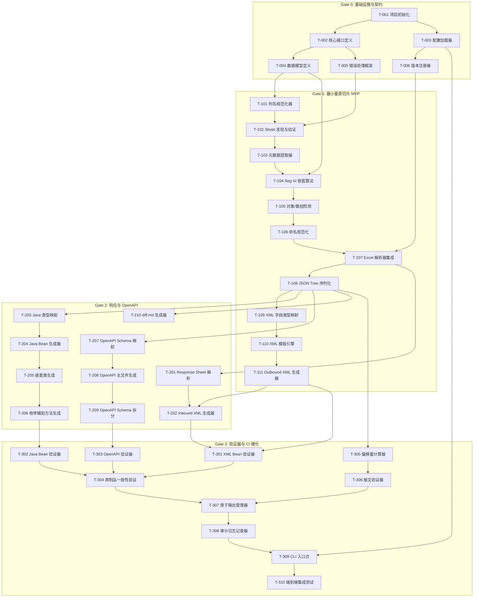

# 任务 DAG (Directed Acyclic Graph)

本文档定义任务之间的依赖关系，以 Mermaid 图和依赖表的形式呈现。

---

## 1. DAG 概览图



---

## 2. 依赖表

### 2.1 Gate 0: 基础设施与契约

| Task ID | 任务名称 | 依赖 | 并行组 | 输出制品 |
|---------|---------|------|--------|---------|
| T-001 | 项目初始化 | - | P0-A | pom.xml, 目录结构 |
| T-002 | 核心接口定义 | T-001 | P0-B | Generator, Parser, Validator 接口 |
| T-003 | 配置加载器 | T-001 | P0-B | Config.java, config.yaml schema |
| T-004 | 数据模型定义 | T-002 | P0-C | FieldNode, MessageModel, Metadata |
| T-005 | 错误处理框架 | T-002 | P0-C | ParseException, ExitCodes |
| T-006 | 版本注册器 | T-003 | P0-C | VersionRegistry, versions.properties |

### 2.2 Gate 1: 最小垂直切片 MVP

| Task ID | 任务名称 | 依赖 | 并行组 | 输出制品 |
|---------|---------|------|--------|---------|
| T-101 | 列名规范化器 | T-004 | P1-A | ColumnNormalizer.java |
| T-102 | Sheet 发现与验证 | T-101, T-005 | P1-B | SheetDiscovery, ColumnValidator |
| T-103 | 元数据提取器 | T-102 | P1-C | MetadataExtractor.java |
| T-104 | Seg lvl 嵌套算法 | T-103, T-004 | P1-D | SegLevelParser.java |
| T-105 | 对象/数组检测 | T-104 | P1-E | ObjectArrayDetector.java |
| T-106 | 命名规范化 | T-105 | P1-F | CamelCaseConverter.java |
| T-107 | Excel 解析器集成 | T-106, T-006 | P1-G | ExcelParser.java |
| T-108 | JSON Tree 序列化 | T-107 | P1-H | DeterministicJsonWriter.java |
| T-109 | XML 字段类型映射 | T-108 | P1-I | XmlTypeMapper.java |
| T-110 | XML 模板引擎 | T-109 | P1-J | XmlTemplateEngine.java |
| T-111 | Outbound XML 生成器 | T-110 | P1-K | OutboundXmlGenerator.java |

### 2.3 Gate 2: 响应与 OpenAPI

| Task ID | 任务名称 | 依赖 | 并行组 | 输出制品 |
|---------|---------|------|--------|---------|
| T-201 | Response Sheet 解析 | T-107 | P2-A | ResponseSheetParser 扩展 |
| T-202 | Inbound XML 生成器 | T-201, T-111 | P2-B | InboundXmlGenerator.java |
| T-203 | Java 类型映射 | T-108 | P2-A | JavaTypeMapper.java |
| T-204 | Java Bean 生成器 | T-203 | P2-B | JavaBeanGenerator.java |
| T-205 | 嵌套类生成 | T-204 | P2-C | NestedClassGenerator.java |
| T-206 | 枚举辅助方法生成 | T-205 | P2-D | EnumHelperGenerator.java |
| T-207 | OpenAPI Schema 映射 | T-108 | P2-A | OpenApiTypeMapper.java |
| T-208 | OpenAPI 主文件生成 | T-207 | P2-B | OpenApiGenerator.java |
| T-209 | OpenAPI Schema 拆分 | T-208 | P2-C | SchemaSplitter.java |
| T-210 | diff.md 生成器 | T-108 | P2-A | DiffMdGenerator.java |

### 2.4 Gate 3: 验证器与 CI 硬化

| Task ID | 任务名称 | 依赖 | 并行组 | 输出制品 |
|---------|---------|------|--------|---------|
| T-301 | XML Bean 验证器 | T-111, T-202 | P3-A | XmlBeanValidator.java |
| T-302 | Java Bean 验证器 | T-206 | P3-A | JavaBeanValidator.java |
| T-303 | OpenAPI 验证器 | T-209 | P3-A | OpenApiValidator.java |
| T-304 | 跨制品一致性验证 | T-301, T-302, T-303 | P3-B | ConsistencyValidator.java |
| T-305 | 偏移量计算器 | T-108 | P3-A | OffsetCalculator.java |
| T-306 | 报文验证器 | T-305 | P3-B | MessageValidator.java |
| T-307 | 原子输出管理器 | T-304, T-306 | P3-C | AtomicOutputManager.java |
| T-308 | 审计日志记录器 | T-307 | P3-D | AuditLogger.java |
| T-309 | CLI 入口点 | T-308, T-003 | P3-E | MqToolCli.java |
| T-310 | 端到端集成测试 | T-309 | P3-F | IntegrationTest.java |

---

## 3. 并行组说明

### Gate 0 并行组

| 并行组 | 包含任务 | 前置条件 |
|--------|---------|---------|
| P0-A | T-001 | 无 |
| P0-B | T-002, T-003 | P0-A 完成 |
| P0-C | T-004, T-005, T-006 | P0-B 完成 |

### Gate 1 并行组

| 并行组 | 包含任务 | 前置条件 |
|--------|---------|---------|
| P1-A | T-101 | Gate 0 完成 |
| P1-B | T-102 | P1-A 完成 |
| P1-C | T-103 | P1-B 完成 |
| P1-D | T-104 | P1-C 完成 |
| P1-E | T-105 | P1-D 完成 |
| P1-F | T-106 | P1-E 完成 |
| P1-G | T-107 | P1-F 完成 |
| P1-H | T-108 | P1-G 完成 |
| P1-I | T-109 | P1-H 完成 |
| P1-J | T-110 | P1-I 完成 |
| P1-K | T-111 | P1-J 完成 |

### Gate 2 并行组

| 并行组 | 包含任务 | 前置条件 |
|--------|---------|---------|
| P2-A | T-201, T-203, T-207, T-210 | Gate 1 完成 |
| P2-B | T-202, T-204, T-208 | P2-A 对应任务完成 |
| P2-C | T-205, T-209 | P2-B 对应任务完成 |
| P2-D | T-206 | P2-C 完成 |

### Gate 3 并行组

| 并行组 | 包含任务 | 前置条件 |
|--------|---------|---------|
| P3-A | T-301, T-302, T-303, T-305 | Gate 2 完成 |
| P3-B | T-304, T-306 | P3-A 对应任务完成 |
| P3-C | T-307 | P3-B 完成 |
| P3-D | T-308 | P3-C 完成 |
| P3-E | T-309 | P3-D 完成 |
| P3-F | T-310 | P3-E 完成 |

---

## 4. 关键路径

关键路径是从起点到终点最长的依赖链，决定了最短完成时间：

```
T-001 → T-002 → T-004 → T-101 → T-102 → T-103 → T-104 → T-105 → T-106 → T-107 → T-108 → T-203 → T-204 → T-205 → T-206 → T-302 → T-304 → T-307 → T-308 → T-309 → T-310
```

**关键路径任务数**: 21 个

---

## 5. 风险依赖

以下任务如果延迟将影响多个下游任务：

| Task ID | 任务名称 | 直接下游数 | 风险级别 |
|---------|---------|-----------|---------|
| T-001 | 项目初始化 | 2 | 高 |
| T-002 | 核心接口定义 | 2 | 高 |
| T-107 | Excel 解析器集成 | 2 | 高 |
| T-108 | JSON Tree 序列化 | 4 | 极高 |
| T-304 | 跨制品一致性验证 | 1 | 中 |

---

**文档结束**
